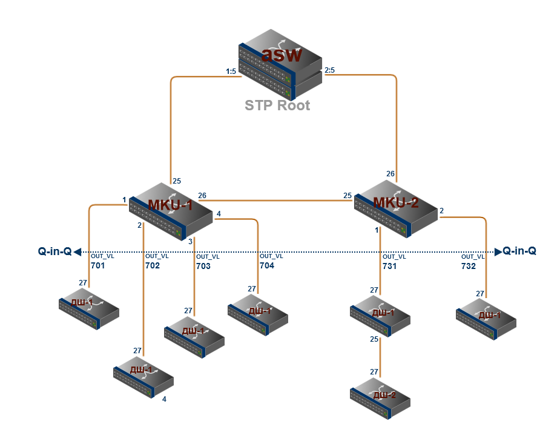

# 1.2 Уровень предагрегации \(preaggregation\)

### _Основные функции_ 

* Агрегация трафика сегментов уровня доступа определенного микрорайона \(МКУ\);
* Взаимная изоляция сегментов уровня доступа за счет использования технологии Q-in-Q \(в том числе и на уровне служебных протоколов\);
* Фильтрация вредоносного для нашей сети трафика;
* Приоритезация трафика сервисов и приложений, критичных к потерям и задержкам \(QoS\);

### _Требования_ 

* Интерфейсы:
  * 24xGigabit Ethernet \(SFP\)
  * 2x10Gigabit Ethernet \(+SFP\)
* Компактные размеры \(глубина не более 320 мм\);
* Пассивная вентиляция.

### _Используемое оборудование_ 

* D-Link DGS-3420-28SC
* D-Link DGS-3420-26SC
* Eltex MES2324FB

### _Топология включения_ 

* _Коммутаторы предагрегации_ подключаются к узлам уровня агрегации по топологии "кольцо".
* Для оптимального распределения нагрузки в одно кольцо может входить **не более 4** \(четырех\) _коммутаторов предагрегации_.
* Сегменты уровня доступа подключаются к _коммутатору предагрегации_ по топологии "звезда".
* Для подключения сегментов уровня доступа используются интерфейсы Gigabit Ethernet \(SFP\).
* Для соединения _коммутаторов предагрегации_ между собой, а также для подключения к узлам уровня агрегации используются интерфейсы 10Gigabit Ethernet \(+SFP\).

_**Рисунок 1.2-1** - общий вид кольца коммутаторов предагрегации_  

### _Политика  модернизации_ 

* Если в часы наибольшей нагрузки трафик на магистральных портах _коммутаторов предагрегации_ превышает **50%** от доступной полосы, кольцо разбивается на 2.
* Если в часы наибольшей нагрузки трафик на интерфейсе, к которому подключен сегмент доступа, превышает **90%** от доступной полосы, подключение сегмента доступа переводится на агрегированный канал \(_802.3ad_\) из двух интерфейсов Gigabit Ethernet.

