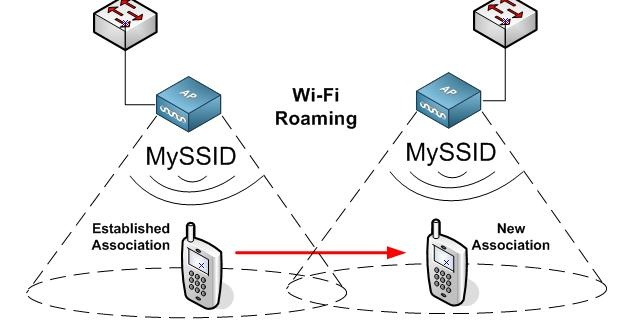

# Технология роуминга/бесшовного покрытия

Роумингом называется процесс переподключения устройства к беспроводной сети при перемещении его в пространстве. Принимаемая мощность радиосигнала ослабевает с расстоянием до передатчика, в результате чего падает эффективная скорость передачи информации, растут канальные ошибки вплоть до обрыва беспроводного соединения. При наличии в радио-сети с одним именем \(SSID\) более чем одной точки доступа перемещение мобильного абонента из зоны уверенной работы в пределах первой точки доступа в зону, где сигнал от второй точки доступа качественнее \(выше мощность, больше отношение сигнал/шум\) может произойти такое переподключение.

Решение об осуществлении переподключения всегда принимает клиентское устройство \(драйвер Wi-Fi адаптера\). Точка доступа может только «подсказать» устройству о желательности данного действия. Иногда можно указать в настройках драйвера параметр «агрессивности» принятия решения. Однако при первоначальном подключении абонента централизованно управляемая система может «заставить» абонента подключиться к предпочтительной \(с точки зрения загрузки\) точке, и на желаемом канале/диапазоне.  
  
Бесшовным называют такой механизм роуминга, при котором потери передаваемых данных, возникающие в момент переключения с точки на точку, минимальны либо равны нулю, а стек TCP/IP клиентской операционной системы даже не замечает факт переключения. Такой механизм важен при эксплуатации чувствительных к задержкам и потерям приложений, таких как передача голоса по радио-сети \(Voice over Wireless\), потокового видео, больших объемов данных и вообще всех случаев, где протокол TCP не в состоянии «переварить» временное пропадание канала передачи данных. 

Кроме того, полезно провести различие между различными беспроводными сценариями подключения, которые могут произойти. Разграничение обеспечит лучшее понимание того, как и когда каждый сценарий будет происходить, почему изменения в производительности между сценариями существуют, и помочь в установлении базовых уровней производительности.

**Начальное подключение** - Клиент не имеет никаких предыдущих 802.11-ассоциаций с ESS \(любой AP, анонсирующей тот же идентификатор SSID\). Такая ситуация требует того, чтобы клиент выполнил все необходимые стандартные действия для соединения и аутентификации, определенные в политике сети, прежде чем получить доступ к сети. Продолжительность времени, необходимого для завершения полной проверки подлинности 802.1X в безопасных беспроводных средах значительно дольше, чем в открытой или PSK-сети, что делает внедрение быстрых методов роуминга весьма желательным. Это может даже потребоваться в зависимости от архитектуры сети и используемых приложений \(например, филиалы / удаленные офисные сети, для которых связность с центральным RADIUS-сервером достижима через глобальную сеть, ещё больше увеличивают время необходимое для завершения EAP аутентификации и могут влиять на приложения, работающие в режиме реального времени \(например, голосовые приложения\), делая их непригодными для использования\).

**Беспроводной роуминг** - Клиент имеет установленную 802.11-ассоциацию с точкой доступа и совершает переход в пределах того же ESS к другой AP. Ассоциация с новой точкой доступа прерывает предыдущую ассоциацию AP явно или неявно \(в соответствии со стандартом 802.11 в один момент времени возможна одна ассоциация\). Цель беспроводного роуминга заключается в определении альтернативной AP, которая может обеспечить более качественное обслуживание для клиента, чем текущая AP.

 Алгоритмы беспроводного роуминга как правило оптимизированы для минимизации времени, требуемого для перехода между точками доступа. Это позволяет избежать прерывания доступа к сети для клиентских приложений. Это может быть достигнуто за счет быстрых методов роуминга или кэширования сеанса, устраняющих некоторые из шагов аутентификации. Быстрый роуминг может произойти только после того, как начальное соединение было выполнено, чтобы гарантировать успешное завершение клиентом всех необходимых проверок подлинности и авторизации используемой сетевой политики.

**Терминация подключения и возобновление** - Клиент имеет установленную 802.11 ассоциацию, но производительность постепенно значительно ухудшается до момента когда качество соединения становится неприемлемым. Клиенту и / или AP требуется обнаружить ухудшение качества соединения, а затем прекратить и повторно установить соединение с нуля. Соединение может деградировать по ряду причин, в том числе помехи, многолучевое распространения \(с более старыми 802.11a/b/g клиентами\), чрезмерной скорости роста пакетных ошибок и т.д.

Так как соединение управляется клиентской станцией, оно, как правило, зависит от внутреннего алгоритма, разработанного производителем, чтобы определить, когда должно произойти включение беспроводного роуминга. Алгоритмы клиента в роуминге не стандартизированы и являются интеллектуальной собственностью каждого производителя. Это приводит к различной производительности клиента при роуминге в зависимости от походов к реализации механизмов производителем.

Тем не менее, с общей точки зрения, все клиентские станции, как правило, выполняют те же самые общие шаги при роуминге, которые включают в себя:

- Пассивное/Активное сканирование в фоновом режиме для идентификации других точек доступа, которые находятся в пределах диапазона  
- Срабатывание триггеров роуминга \(как правило это проприетарные алгоритмы вендора, но чаще всего они основаны на пороговых значениях интенсивности сигнала, RSSI между точками доступа, дата рэйтах, частоты появления ошибок и попыток повторно отправить 802.11-фреймы\)  
- Активное сканирование для подтверждения доступности новой точки  
- Роуминг к новой точке доступа

Стандарты k и r рабочей группы 802.11 позволяют пользователям выполнять более плавный переход от одной точки доступа к другой в рамках одной сети.

**802.11r** формирует трехуровневую референсную архитектуру, которая делит сеть доступа стандарта WiFi на зоны мобильности \(mobility zones\). Зона мобильности определяется как группа Точек Доступа WiFi , которые соединяются и управляются центральным устройством управления \(чаще всего это контроллер сети WiFi\). Обычно соседние точки доступа, покрывающие определенную географическую зону, группируются в одну зону мобильности.

Точки Доступа WiFi, которые поддерживают 802.11r, передают информацию о поддержке 11r во фреймах Beacon и Probe response, путем включения специального элемента MDIE \(Mobility Domain Information Element\), описанном в стандарте 11r.

Когда устройство переходит с одной точки доступа на другую в рамках одной сети, стандарт 802.11r использует функцию FT \(Fast Basic Service Set Transition — быстрая передача базового набора служб\) для ускорения аутентификации. Функция FT работает с обоими методами аутентификации, PSK \(Preshared Key — общий ключ\) и 802.1X. Можно найти исследования, которые показывают, что быстрый обмен 802.11r через радиоканал требует 40-50 мс \(без учета времени сканирования, т.к. это очень вариативный показатель\). Это значительно более быстрая технология, чем использование традиционной схемы хендоверов 802.11i, требующей EAP-аутентификации на каждом хендовере.  
  
Важно помнить, что поддержка 802.11r зависит не только от Wi-Fi инфраструктуры, но и от пользовательских мобильных устройств.

Стандарт **802.11k** позволяет ускорить поиск ближайших целевых точек доступа при роуминге путем создания оптимизированного списка каналов. Если уровень сигнала от текущей точки доступа ослабевает, устройство выполняет поиск целевых точек доступа из этого списка. Обычно в беспроводной локальной сети абонентское устройство обычно соединяется с той точкой доступа, которая обеспечивает наиболее сильный сигнал. Нередко это приводит к перегрузке сети в одной точке, когда к одной Точке Доступа подключется сразу много пользователей. Для контроля подобных ситуаций в стандарте 802.11k предложен механизм, ограничивающий количество абонентов, подключаемых к одной Точке Доступа, и дающий возможность создания условий, при которых новые пользователи будут присоединяться к другой ТД даже несмотря на более слабый сигнал от нее. В этом случае аггрегированная пропускная способность сети увеличивается благодаря более эффективному использованию ресурсов.

