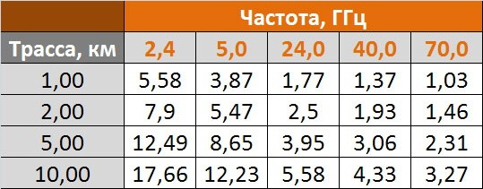

# Зона Френеля

[Наглядный калькулятор](https://airlink.ubnt.com/#/) зоны Френеля от Ubiquiti. Или [вот такой](http://www.wirelessconnections.net/calcs/FresnelZone.asp). А ещё [такой](http://www.everythingrf.com/rf-calculators/fresnel-zone-calculator).

Для эффективной связи с помощью высокочастотных волн нужно обеспечить беспрепятственную линию прямой видимости между антеннами приемопередатчиков.

При ответе на него удобно использовать такое понятие, как зоны Френеля.

Зона Френеля это эллипсоид вокруг прямой линии \(LoS/Line of Sight\), связывающей излучатель радиосигнала и приемник. Не менее 60% зоны Френеля должно оставаться чистой от каких-либо препятствий, т.к. иначе начинаются существенные потери сигнала в канале.  
В разных источниках рекомендации для чистоты зоны варьируются от 60% до 80%, поэтому результат вывода имеет три дополнительные информационные позиции: 60%, 70% и 80%.

Также было установлено, что большая часть энергии сигнала сконцентрирована в так называемой «минимальной зоне», радиус которой в каждой точке линии прямой видимости соответствует приблизительно 60% от радиуса первой зоны Френеля \(по различным данным от 60 до 80%\).  Считается, что если в минимальной зоне препятствия отсутствуют, то влиянием от прочих препятствий  \(даже попадающих в первую зону Френеля\) можно пренебречь.

Радиус сечения эллипсоида первой зоны Френеля в каждой точке трассы может быть рассчитан по формуле:

где R - радиус в метрах, S — расстояние от точки до передатчика в км, D — расстояние от точки до приемника в км \(общая длина радиотрассы S + D\), f – несущая частота в ГГц.  
  
Максимальный радиус первой зоны Френеля соответствует точке, находящейся на середине радиотрассы. Радиус зависит от длины трассы и несущей частоты приемопередатчиков.  
  
В качестве примера в таблице приведены расчетные значения максимального радиуса первой зоны Френеля \(в метрах\) в зависимости от длины трасс и частотных диапазонов.

