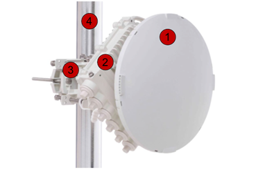
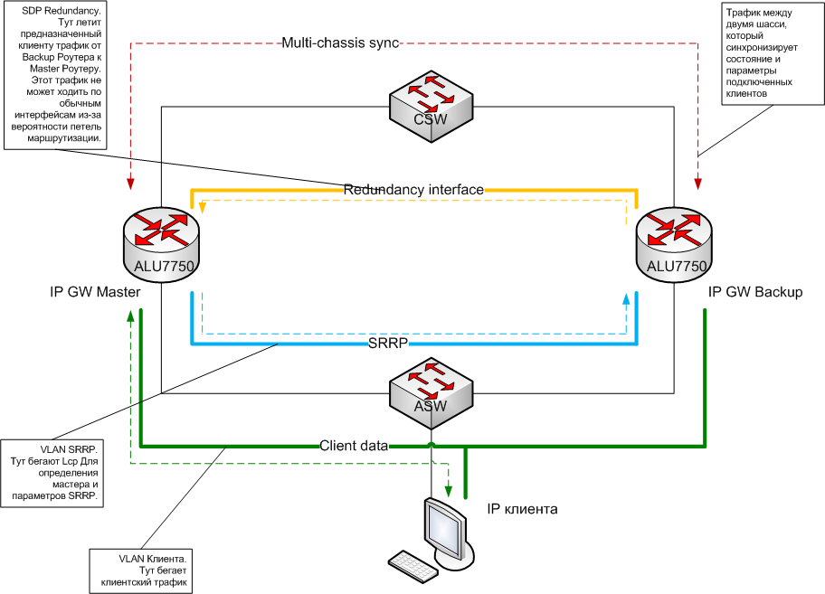

# Резервирование шлюза по умолчанию. VRRP, SRRP

### **Введение**

При подключении любого устройства к сети передачи данных, в большинстве случаев необходимо настроить сетевые параметры, такие как IP адрес, маска подсети и IP адрес шлюза по умолчанию, это можно сделать как вручную, так и с помощью сервисов работающих в сети \(напр. DHCP\). IP адрес и маска определяют принадлежность устройства к определенному сегменту сети, а IP адрес шлюза указывает на устройство \(маршрутизатор\), через которое будет проходить трафик во все остальные сети. Очевидно, что от доступности шлюза зависит будут ли доступны внешние ресурсы, а значит шлюз \(его IP адрес\) является критичной точкой отказа и для повышения отказоустойчивости сети его необходимо резервировать.

### **VRRP**

Для резервирования маршрутизатора был разработан протокол **VRRP \(Virtual Router Redundancy Protocol**\), который описан в [RFC 2338](http://tools.ietf.org/html/rfc2338). В этой статье мы постараемся кратко изложить основные моменты и принцип работы данного протокола.

Несколько маршрутизаторов настраиваются на принадлежность их одному виртуальному маршрутизатору, который идентифицируется **Virtual Router Identifier \(VRID\)** и виртуальным IP адресом \(тот адрес который необходимо зарезервировать\). Среди этих маршрутизаторов происходит выбор одного **Virtual Router Master** , который и будет ассоциирован с виртуальными IP и MAC адресами, будет отвечать на ARP и маршрутизировать трафик. В любой момент времени только один физический маршрутизатор может выполнять роль **Virtual Router Master**. Остальные маршрутизаторы становятся **Virtual Router Backup**, а в случае недоступности мастера, один из backup роутеров берет на себя роль master роутера. По сути протокол VRRP определяет процедуру динамического выбора устройства ответственного за виртуальный маршрутизатор \(ip и mac адрес\) в локальной сети.

### **Определения**

**VRRP Router** - маршрутизатор на котором настроен VRRP, на одном физическом роутере может использоваться несколько виртуальных роутеров.

**Virtual Router** - виртуальный роутер, то что необходимо резервировать и как правило прописывается шлюзом по умолчанию у устройств в сети.

**IP Address Owner** - владелец IP адреса, роутер у которого резервируемый адрес прописан на интерфейсе как основной, этот роутер всегда будет иметь наибольший приоритет в выборе мастера. Только один роутер в сети может быть владельцем IP \(иначе в сети будет дублирование ip адресов\).

**Primary IP Address** - если на интерфейсе прописано несколько IP адресов, то среди них выбирается основной, который будет использоваться в качестве src-ip для отправляемых объявлений. Как правило выбирается первый по списку адрес.

**Virtual Router Master** - маршрутизатор, который отвечает за виртуальные \(резервируемые\) IP адрес и MAC адрес, отвечает на ARP и форвардит пакеты.

**Virtual Router Backup** - маршрутизатор, который является резервным и готов стать мастером в случае недоступности текущего мастера.

**Объявления** - мультикаст пакеты, которые отправляет мастер через определенный период времени на адрес 224.0.0.18 Этот адрес закреплен за VRRP в стандарте. Объявления содержат в себе информацию о резервируемых IP адресах, приоритете роутера, интервале объявлений и параметров аутентификации.

### **Параметры**

**VRID** - это идентификатор виртуального маршрутизатора, указывается в диапазоне от 1 до 255. Обязательный параметр.

**Priority** - это значение приоритета, которое будет использоваться при выборе мастера. Диапазон 1-254. Значение 255 зарезервировано для владельца IP-адреса, значение 0 зарезервированно для Master router. Значение по умолчанию 100. Чем выше значение, тем выше приоритет.

 **Virtual IP\_Addresses** - один или несколько IP адресов ассоциированных с виртуальным роутером.

**Advertisement\_Interval** - временной интервал между отправкой мастером обновлений. Значение по умолчанию 1 сек.

**Skew\_Time** - временной интервал для отклонения Master\_Down\_Interval. Рассчитывается по формуле \(256-Priority\)/256. Из формулы видно что, чем больше приоритет, тем меньше Skew\_Time.

**Master\_Down\_Interval** - временной интервал, через который Backup роутер объявит себя мастером. Рассчитывается по формуле \(3 \* Advertisement\_Interval\) + Skew\_time  Это значит, что если мастер не присылает обновления 3 раза, то выжидается еще Skew\_time  и только потом отправляется обявление себя мастером. Тот роутер, который имеет выше приоритет, имеет меньшее Skew\_Time и значит раньше объявит себя мастером.

**Preempt\_Mode** - это режим который определяет, будет ли Backup роутер с большим приоритетом пытаться перехватить роль мастера у роутера с меньшим приоритетом. Такая ситуация возникает, когда после устранения неисправности бывший мастер возвращается в сеть, либо когда появляется новый vrrp роутер с более высоким приоритетом. Если роутер является владельцем IP, то этот режим игнорируется и роутер всегда обявляет себя мастром.

**Virtual Router MAC Address** - mac адрес виртуального роутера. Рекомендуется использовать следующий адрес 00-00-5E-00-01-{VRID}

### **Состояния VRRP роутеров**

**Initialize**  
Начало работы. После включения VRRP, роутер проверяет свои параметры.  
Если он является владельцем IPадреса, то посылает VRRP-объявление, потом gratuitous ARP и становится **Virtual Router Master**.  
Если он не является владельцем, то переходит в состояние **Virtual Router Backup**.

**Backup**  
В этом состоянии роутер не отвечает на ARP запросы и не обрабатывает трафик предназначенный виртуальному маршрутизатору, Роутер просто обрабатывает объявления отправляемые мастером. Если от мастера перестали приходить объявления, то через **Master\_Down\_Interval** роутер объявит себя мастером.

**Master**  
В этом состоянии роутер ассоциирует себя с IP и MAC адресами виртуального роутера \(то что надо резервировать\), отвечает на ARP, форвардит трафик и т.д.  
В этом состоянии роутер отправляет объявления с периодом **Advertisement\_Interval**.    

**Использование в нашей сети**

В нашей сети VRRP используется для резервирования шлюза по умолчанию для всех служебных серверов - DNS, VoIP, Billing, серверов мониторинга и управления сетью и т.п.  
При использовании VRRP, нет необходимости поднимать на серверах динамические протоколы маршрудизации для оперативного изменения маршрута, Так же надо отметить, что протокол стандартный и поэтому совместим между оборудованием разных вендоров.  
BSR01 настраивается как владелец IP адреса, поэтому в нормальной ситуации он всегда является мастером.

BSR02 как обычный VRRP router с дефолтным приоритетом 100, в дополнение мы разрешаем роутеру отвечать на ping и trace, когда он становится мастером.

### **Резервирование абонентских сессий на BSR**

К сожалению мы не можем использовать VRRP для резервирования шлюза по умолчанию для наших IPoE клиентов. Для этого есть 2 причины:

1. Один VRRP VRID работает только в пределах одного VLAN, а у нас все клиенты изолируются друг от друга с помощью Q-in-Q. VRID ограничен значением 255 и этого явно не хватит на все VLAN.
2. Прежде чем трафик любого нашего абонента начнет форвардится, должна пройти процедура аутентификации \(проверки подлинности\), которая проходит на основе PPPoE Discovery, DHCP-Discover или ARP запроса в зависимости от типа абонента, но для клиентов изменение **Virtual Router Master**  проходит незаметно и они не отправляют вышеуказанные пакеты, а значит не авторизуются на резервном роутере и их трафик блокируется. Для PPPoE клиентов это не большая проблема, с помощью протокола LCP происходит разрыв сессии и установка новой, а вот для DHCP и Static-IP клиентов это является проблемой.

Нет никакого стандартного решения этой проблемы, поэтому все вендоры пытаются решить ее по своему. Ниже приведем каким образом решается эта проблема на оборудовании Alcatel-Lucent SR7750

В качестве альтернативы VRRP, используется проприетарный протокол SRRP \(Subscriber Routing Redundancy Protocol\), за основу которого взят VRRP. Используются теже самые параметры. Но SRRP настраивается на групповом интерфейсе и обновления от мастера ходят в отдельном, специально созданном SAP, а не в клиентских VLAN. При этом виртуальные IP и MAC адреса работают как раз в клиентских VLAN и в случае смены мастера, он меняется на всех SAP группового интерфейса. Таким образом один VRID можно использовать для резервирования шлюза в большом количестве VLAN.

С целью экономии ресурсов, мы не используем SRRP для PPPoE абонентов. В настоящий момент в нашей сети SRRP настраивается только для ARP-Host и DHCP абонентов \(в том числе Wi-Fi\).

В SRRP может работать только два маршрутизатора.

В SRRP нельзя настроить владельца адреса, виртуальный адрес шлюза не может совпадать с основным адресом на интерфейсе.

Групповые интерфейсы на роутерах должны иметь одинаковые названия.

Для того чтобы исключить процедуру аутентификации, в случае смены виртуального роутера, между двумя BSR настраивается синхронизация состоянии абонентских сессий. От роутера, который выполняет роль мастера передается список всех абонентов \(со всеми свойствами\) резервируемого группового интерфейса на роутер, который находится в состоянии backup. На резервном роутере эти сессии находятся в состоянии ожидания и переходят в активное только после смены мастера.

