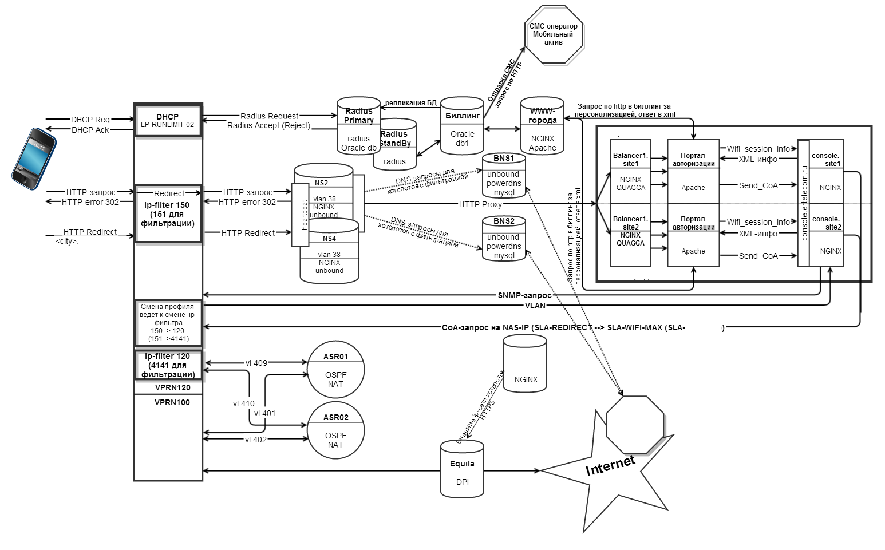

# Схема работы Wi-fi Hotspot в ядре

1.Клиент, ассоциировавшись с ТД делает DHCP-запрос к брасу. Брас делает запрос к радиус-серверу \(биллингу\), проверяется по влану существует ли хотспот  и положительной проверке отвечает accept \(иначе reject\). При ответе accept от радиус-сервера брас выдает IP-адрес клиенту с SLA-профилем SLA-REDIRECT.

2.Клиент делает запрос на любой http-ресурс. Брас редиректит весь такой трафик на плавающий адрес \#\#\#\#, стерминированный на одном из NS \(как правило NS4\). Трафик с этого интерфейса передается на локальный nginx, после чего проксируется на портал авторизации, который находится в  WEB-кластере \(город \#\#\#\# и город \#\#\#\#\).

3.Портал по http обращается к демону wifi\_session\_info, который запущен на сервере console. Этот демон по конфигу определяет к какому городу принадлежит адрес и по snmp запрашивает у соответствующего браса vlan, в котором стерминирован клиент. В качестве параметра передается серый ip-адрес клиента. 

4.Имея влан хотспота, с которого пришел запрос, портал делает запрос в биллинг для выяснения гостевой скорости, наличия СМС для авторизации, наличия редиректа на рекламную страницу после авторизации и т.д.

5.После ответа биллинга портал по http вызывает скрипт send\_CoA, который находится на сервере console. Этот скрипт отправляет CoA-пакет на брас с изменением SLA-профиля на абонентский \(SLA-WIFI-MAX\) или гостевой \(SLA-\#\#\#\#\). Если биллинг не ответил, то срабатывает механизм резервной авторизации и на брас отправляется CoA-пакет, меняющий SLA-профиль на абонентский \(SLA-WIFI-MAX\). 

6.После изменения SLA-профиля клиент редиректится на ASR01/ASR02. Редирект происходит на основе ip-адреса в фильтре 120, нечетные адреса идут на ASR01, четные на ASR02. На ASR происходит NAT и клиент выходит в интернет.

### Оборудование

1.Брас  
2.Сервер NS2/NS4  
3.Балансер  
4.Console  
5.ASR

<table>
  <thead>
    <tr>
      <th style="text-align:left">&#x41F;&#x430;&#x440;&#x430;&#x43C;&#x435;&#x442;&#x440; &#x43C;&#x43E;&#x43D;&#x438;&#x442;&#x43E;&#x440;&#x438;&#x43D;&#x433;&#x430;</th>
      <th
      style="text-align:left">Treshold</th>
        <th style="text-align:left"></th>
    </tr>
  </thead>
  <tbody>
    <tr>
      <td style="text-align:left">&#x434;&#x43E;&#x441;&#x442;&#x443;&#x43F;&#x43D;&#x43E;&#x441;&#x442;&#x44C;</td>
      <td
      style="text-align:left"></td>
        <td style="text-align:left"></td>
    </tr>
    <tr>
      <td style="text-align:left">&#x437;&#x430;&#x433;&#x440;&#x443;&#x437;&#x43A;&#x430; CPU</td>
      <td style="text-align:left">&gt;85%</td>
      <td style="text-align:left"></td>
    </tr>
    <tr>
      <td style="text-align:left">&#x437;&#x430;&#x433;&#x440;&#x443;&#x437;&#x43A;&#x430; &#x441;&#x435;&#x442;&#x435;&#x432;&#x44B;&#x445;
        &#x438;&#x43D;&#x442;&#x435;&#x440;&#x444;&#x435;&#x439;&#x441;&#x43E;&#x432;</td>
      <td
      style="text-align:left"></td>
        <td style="text-align:left"></td>
    </tr>
    <tr>
      <td style="text-align:left">&#x438;&#x441;&#x43F;&#x43E;&#x43B;&#x44C;&#x437;&#x43E;&#x432;&#x430;&#x43D;&#x438;&#x435;
        &#x43F;&#x430;&#x43C;&#x44F;&#x442;&#x438;</td>
      <td style="text-align:left">&gt;85%</td>
      <td style="text-align:left"></td>
    </tr>
    <tr>
      <td style="text-align:left">&#x43A;&#x43E;&#x43B;-&#x432;&#x43E; NAT-&#x442;&#x440;&#x430;&#x43D;&#x441;&#x43B;&#x44F;&#x446;&#x438;&#x439;</td>
      <td
      style="text-align:left">
        
&lt;50000*IP&#x431;&#x435;&#x43B;&#x44B;&#x445;

        
&gt;0 &#x432; 7.00-0.00

        </td>
        <td style="text-align:left"></td>
    </tr>
    <tr>
      <td style="text-align:left">&#x43F;&#x435;&#x440;&#x435;&#x437;&#x430;&#x433;&#x440;&#x443;&#x437;&#x43A;&#x430;</td>
      <td
      style="text-align:left"></td>
        <td style="text-align:left"></td>
    </tr>
  </tbody>
</table>