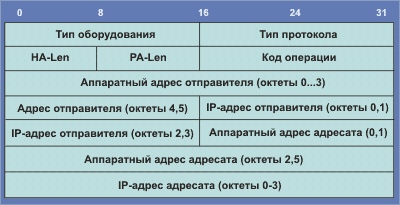

# ARP, RARP

### **ARP**

Протокол ARP \(address resolution protocol, RFC-826, std-38\) решает проблему преобразования IP-адреса в МАС-адрес.

Рассмотрим процедуру преобразования адресов при отправлении сообщения. Пусть одна ЭВМ отправляет сообщение другой. Прикладной программе IP-адрес места назначения обычно известен. Для определения Ethernet-адреса просматривается ARP-таблица. Если для требуемого IP-адреса в ней присутствует МАС-адрес, то формируется и посылается соответствующий пакет. Если же с помощью ARP-таблицы не удается преобразовать адрес, то выполняется следующее:

1. Всем машинам в сети посылается пакет с ARP-запросом \(с широковещательным МАС-адресом\).  
2. Исходящий IP-пакет ставится в очередь.

Каждая машина, принявшая ARP-запрос, в своем ARP-модуле сравнивает собственный IP-адрес с IP-адресом в запросе. Если IP-адрес совпал, то прямо по МАС-адресу отправителя запроса посылается ответ, содержащий как IP-адрес ответившей машины, так и ее МАС-адрес. После получения ответа на свой ARP-запрос машина имеет требуемую информацию о соответствии IP и МАС-адресов, формирует соответствующий элемент ARP-таблицы и отправляет IP-пакет, ранее поставленный в очередь. Если же в сети нет машины с искомым IP-адресом, то ARP-ответа не будет и не будет записи в ARP-таблицу. Протокол IP будет уничтожать IP-пакеты, предназначенные для отправки по этому адресу.

Протоколы верхнего уровня не могут отличить случай повреждения в среде ethernet от случая отсутствия машины с искомым IP-адресом. Во многих реализациях в случае, если IP-адрес не принадлежит локальной сети, внешний порт сети \(gateway\) или маршрутизатор откликается, выдавая свой физический адрес \(режим прокси-ARP\).

Функционально, ARP делится на две части. Одна - определяет физический адрес при посылке пакета, другая отвечает на запросы других машин. ARP-таблицы имеют динамический характер, каждая запись в ней "живет" определенное время после чего удаляется. Менеджер сети может осуществить запись в ARP-таблицу, которая там будет храниться "вечно". ARP-пакеты вкладываются непосредственно в ethernet-кадры.

Рис. Формат пакета ARP

HA-Len - длина аппаратного адреса; PA-Len - длина протокольного адреса \(длина в байтах, например, для IP-адреса PA-Len=4\). Тип оборудования - это тип интерфейса, для которого отправитель ищет адрес; код содержит 1 для Ethernet.

Поле код операции определяет, является ли данный пакет ARP-запросом \(код = 1\), ARP-откликом \(2\), RARP-запросом \(3\), или RARP-откликом \(4\). Это поле необходимо, как поле тип кадра в Ethernet пакетах, они идентичны для ARP-запроса и отклика.

ARP-таблицы строятся согласно документу RFC-1213 и для каждого IP-адреса содержит четыре кода:ifindex Физический порт \(интерфейс\), соответствующий данному адресу; физический адрес MAC-адрес.  
IP-адрес, соответствующий физическому адресу;  
тип адресного соответствия это поле может принимать 4 значения: 1 - вариант не стандартный и не подходит ни к одному из описанных ниже типов; 2 - данная запись уже не соответствует действительности; 3 - постоянная привязка; 4 - динамическая привязка;

ARP запросы могут решать и другие задачи. Так при загрузке сетевого обеспечения ЭВМ такой запрос может выяснить, а не присвоен ли идентичный IP-адрес какому-то еще объекту в сети. При смене физического интерфейса такой запрос может инициировать смену записи в ARP-таблице.

В рамках протокола ARP возможны самообращенные запросы \(gratuitous ARP\). При таком запросе инициатор формирует пакет, где в качестве IP используется его собственный адрес. Это бывает нужно, когда осуществляется стартовая конфигурация сетевого интерфейса. В таком запросе IP-адреса отправителя и получателя совпадают.

Самообращенный запрос позволяет ЭВМ решить две проблемы. Во-первых, определить, нет ли в сети объекта, имеющего тот же IР-адрес. Если на такой запрос придет отклик, то ЭВМ выдаст на консоль сообщение Dublicate IP address sent from Ethernet address &lt;...&gt;. Во-вторых, в случае смены сетевой карты производится корректировка записи в АRP-таблицах ЭВМ, которые содержали старый МАС-адрес инициатора. Машина, получающая ARP-запрос c адресом, который содержится в ее таблице, должна обновить эту запись.

Вторая особенность такого запроса позволяет резервному файловому серверу заменить основной, послав самообращенный запрос со своим МАС-адресом, но с IP вышедшего из строя сервера. Этот запрос вынудит перенаправление кадров, адресованных основному серверу на резервный. Клиенты сервера при этом могут и не знать о выходе основного сервера из строя. При этом возможны и неудачи, если программные реализации в ЭВМ не в полной мере следуют регламентация протокола ARP.

### **RARP** 

Когда загружается система с локальным диском, она обычно получает свой IP адрес из конфигурационного файла, который считывается с диска. Однако для систем, не имеющих диска, таких как X терминалы или бездисковые рабочие станции, требуются другой способ определения собственного IP адреса.

Каждая система в сети имеет уникальный аппаратный адрес, который назначается производителем сетевого интерфейса \(сетевой платы\). Принцип работы RARP заключается в том, что бездисковая система может считать свой уникальный аппаратный адрес с интерфейсной платы и послать RARP запрос \(широковещательный фрейм в сеть\), где потребует кого-нибудь откликнуться и сообщить IP адрес \(с помощью RARP отклика\).

Несмотря на то что концепция довольно проста, ее реализация как правило значительно сложнее чем ARP, который был описан выше. Официальная спецификация RARP находится в RFC 903 \[Finlayson et al. 1984\].

Формат пакета RARP практически идентичен пакету ARP. Единственное отличие заключается в том, что поле тип фрейма \(frame type\) для запроса или отклика RARP установлено в 0x8035, а поле op имеет значение 3 для RARP запроса и значение 4 для RARP отклика.

RARP запрос является широковещательным, а RARP отклик обычно персональный.

