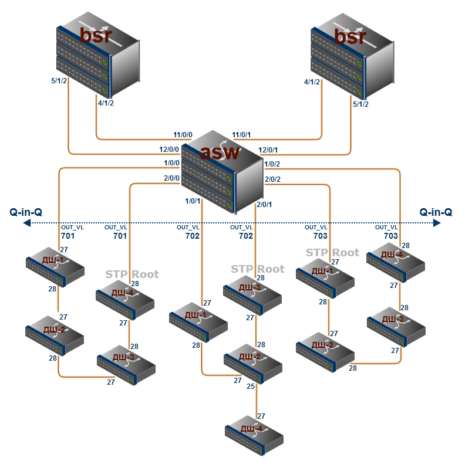

# 1.3 Уровень агрегации \(aggregation\)

### _Основные функции_ 

* Агрегация трафика сегментов _уровня доступа_ или _предагрегации_ определенного района \(ПГС/МГС\);
* Взаимная изоляция сегментов _уровня доступа_ за счет использования технологии Q-in-Q \(в том числе и на уровне служебных протоколов\);
* Фильтрация вредоносного для нашей сети трафика;
* Приоритезация трафика сервисов и приложений, критичных к потерям и задержкам \(QoS\);

### _Требования_ 

_В городах с топологией "звезда" на доступе:_

* Интерфейсы:
  * 48x10Gigabit Ethernet \(+SFP, wire speed\);
* Компактные размеры \(не более 2 RU\);
* Резервирование блоков питания, возможность их горячей замены;
* Поддержка не менее 80 000 MAC адресов;

В городах _с топологией "кольцо" на доступе:_

* Интерфейсы:
  * 400xGigabit Ethernet \(SFP\);
  * 8x10Gigabit Ethernet \(+SFP, XFP\);
* Модульная наращиваемая архитектура;
* Возможность «горячей» замены всех элементов коммутатора \(модулей управления, фабрик коммутации, блоков питания, интерфейсных плат\);
* Поддержка не менее 128 000 MAC адресов;

### _Используемое оборудование_ 

* Huawei Quidway S93xx;
* ZTE ZXR10 89хх;
* Extreme Summit X670V;
* D-Link DGS 3627G;
* D-Link DGS-3420-28SC;

### _Топологии включения_ 

_В городах с  топологией "звезда" на доступе:_

* К _коммутатору агрегации_ подключаются кольца коммутаторов _уровня предагрегации_ и _сервисные маршрутизаторы \(bsr\)_\(см. рис. 1.3-1\)_;_
* Каждое кольцо коммутаторов _уровня предагрегации_ при подключении к узлу агрегации замыкается на интерфейсы разных линейных плат _одного коммутатора агрегации_ или разных коммутаторов в стеке;
* Каждое кольцо коммутаторов _уровня предагрегации_ представляет собой изолированный STP сегмент. Для этого между портами _коммутатора агрегации_, к которым подключено кольцо коммутаторов _уровня предагрегации,_ настраивается _BPDU Tunnel._
* Для подключения _коммутатора агрегации_ к _сервисным маршрутизаторам_ используются 10Gigabit Ethernet интерфейсы с разными физическими трассами, на основе  которых рекомендуется собирать агрегированный логический канал. На _коммутаторе агрегации_ физические интерфейсы для агрегированного канала выбираются с разных линейных плат \(разных коммутаторов стека\);
* Допускается подключение _коммутатора агрегации_ к _сервисным маршрутизаторам_ через другой аналогичный узел агрегации. В этом случае для соединения узлов агрегации между собой  используются агрегированный логический канал на основе 10Gigabit Ethernet интерфейсов с разными физическими трассами.

_**Рисунок 1.3-1** - общий вид узла агрегации в городах с топологией "звезда" на доступе_  

* Допускается использование на уровне агрегации двух отдельных коммутаторов, не собранных в стек \(см. рис. 1.3-2\). В этом случае коммутаторы соединяются между собой агрегированным логическим каналом, на котором разрешается прохождение всех VLAN. Как и в случае со стеком, между портами _коммутаторов агрегации_, к которым подключено кольцо коммутаторов _уровня предагрегации,_ настраивается _BPDU Tunnel._

_**Рисунок 1.3-2** - общий вид узла агрегации без стека в городах с топологией "звезда" на доступе_

_В городах с топологией "кольцо" на доступе:_

* К _коммутатору агрегации_ подключаются кольца коммутаторов _уровня доступа_ и _сервисные маршрутизаторы \(bsr\)_;
* Каждое кольцо доступа __при подключении к узлу агрегации замыкается на интерфейсы разных линейных плат _одного коммутатора агрегации_;
* Каждое кольцо доступа __представляет собой изолированный STP сегмент. Для этого между портами _коммутатора агрегации_, к которым подключено кольцо доступа_,_ настраивается _BPDU Tunnel._
* Для подключения _коммутатора агрегации_ к _сервисным маршрутизаторам_ используются 10Gigabit Ethernet интерфейсы с разными физическими трассами, на основе  которых рекомендуется собирать агрегированный логический канал. На _коммутаторе агрегации_ физические интерфейсы для агрегированного канала выбираются с разных линейных плат;
* Допускается подключение _коммутатора агрегации_ к _сервисным маршрутизаторам_ через другой аналогичный узел агрегации. В этом случае для соединения узлов агрегации между собой  используются агрегированный логический канал  на основе 10Gigabit Ethernet интерфейсов с разными физическими трассами.

_**Рисунок 1.3-3** - общий вид  узла агрегации в городах с топологией "кольцо" на доступе_

### _Политика модернизации_ 

_В городах с  топологией "звезда" на доступе:_

* Если в часы наибольшей нагрузки трафик на интерфейсах, к которым подключено _кольцо предагрегации_, превышает **50%** от доступной полосы, кольцо разбивается на 2 или осуществляется переход на 10G. Если после разбивки в кольце остается только один _коммутатор предагрегации_, линки, используемые для его подключения к _коммутатору агрегации_, объединяются в агрегированный канал \(802.3ad\).
* Если в часы наибольшей нагрузки трафик на интерфейсах, используемых для подключения к _сервисным маршрутизаторам_, превышает **50%** от доступной полосы, допускаются следующие варианты модернизации:
  * в существующие агрегированные каналы добавляются дополнительные 10G интерфейсы;
  * собираются дополнительные агрегированные каналы до каждого из _сервисных маршрутизаторов_ \(на первоначальном этапе в эти  каналы может входить только по одному интерфейсу\);
* Если количество занятых портов 10Gigabit Ethernet  достигает **90%** от их количества в коммутаторе, принимается решение об установке дополнительных плат либо о замене устройства.

_В городах с топологией "кольцо" на доступе:_

* Если в часы наибольшей нагрузки трафик на интерфейсах, к которому подключено _кольцо доступа_, превышает **50%** от доступной полосы, кольцо разбивается на два.
* Если в часы наибольшей нагрузки трафик на интерфейсах, используемых для подключения к _сервисным маршрутизаторам_, превышает **50%** от доступной полосы, допускаются следующие варианты модернизации:
  * в существующие агрегированные каналы добавляются дополнительные 10G интерфейсы;
  * собираются дополнительные агрегированные каналы до каждого из _сервисных маршрутизаторов_ \(на первоначальном этапе в эти  каналы может входить только по одному интерфейсу\);

