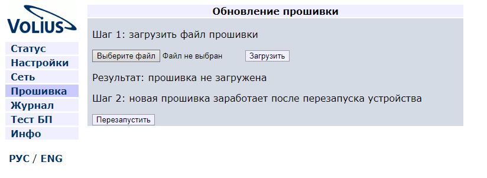
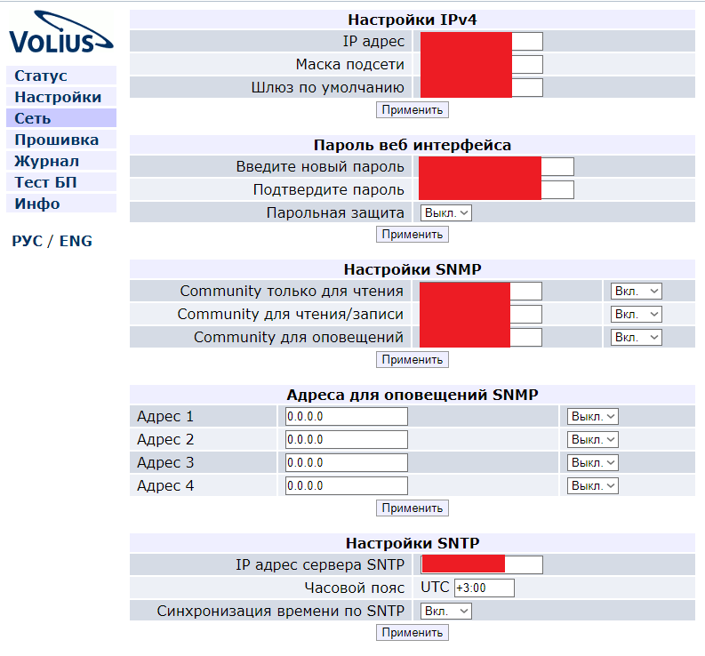

# ОП Volius VS5793

Оптический приемник кабельного телевидения приемник Volius VS5793 

### Описание

На передней панели видим один оптический вход, индикатор, с помощью которого можно настроить или проверить конфигурацию, далее идет тестовый выход \(сигнал на 20Дб выше\), обычный выход, RJ-45 вход управления, пины для снятия или ввода данных \(подключение датчиков\) и два разъема питания \(12V\1,5A\) 

### Порядок настройки

1. Подключаемся патчкордом. IP-адрес по умолчанию 192.168.0.123. Заходим через браузер.
2. Проверяем что версия прошивки самая актуальная. Это можно посмотреть на вкладке "Инфо"

Если нужно обновить прошивку идем на вкладку "Прошивка". 

Нажимаем "Выберите файл", выбираем файл нашей прошивки в формате .txt и нажимаем кнопку "Загрузить". Файл прошивки выглядит подобным образом.

3. Далее на вкладке "Сеть" настраиваем всё под себя.

Нажимаем везде применить и оптический приемник настроен.  
Так же на приемнике есть 3 кнопки. Долгим зажатием Set можно попасть в режим настройки. На этом индикаторе можно увидеть такие параметры как IP \(IP\), маска подсети \(S.n.\), шлюз \(d.r.\) и т.д

### Другие пункты меню

