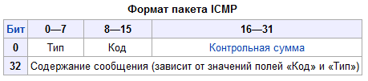

# ICMP

**ICMP** \(англ. Internet Control Message Protocol — протокол межсетевых управляющих сообщений\[1\]\) — сетевой протокол, входящий в стек протоколов TCP/IP. В основном ICMP используется для передачи сообщений об ошибках и других исключительных ситуациях, возникших при передаче данных, например, запрашиваемая услуга недоступна, или хост, или маршрутизатор не отвечают. Также на ICMP возлагаются некоторые сервисные функции.

**Технические подробности**  
Протокол ICMP описан в RFC 792 \(с дополнениями в RFC 950\) и является стандартом Интернета \(входит в стандарт STD 5 вместе с IP\). Хотя формально ICMP использует IP \(ICMP-пакеты инкапсулируются в IP пакеты\), он является неотъемлемой частью IP и обязателен при реализации стека TCP/IP. Текущая версия ICMP для IPv4 называется ICMPv4. В IPv6 существует аналогичный протокол ICMPv6.  
ICMP-сообщение строится из IP-пакетов, сгенерировавших ICMP-ответ. IP инкапсулирует соответствующее ICMP-сообщение с новым заголовком IP \(чтобы отправить ICMP-сообщение обратно отправителю\) и передает полученные пакеты дальше.  
Например, каждая машина \(такая, как маршрутизатор\), которая перенаправляет IP-пакеты, уменьшает Time to live \(TTL\) поля заголовка IP на единицу, если TTL достигает 0, ICMP-сообщение о превышении TTL отправляется на источник пакета.  
Каждое ICMP-сообщение инкапсулируется непосредственно в пределах одного IP-пакета, и, таким образом, как и UDP, ICMP является ненадежным \(надежным является TCP\).

ICMP основан на протоколе IP. Его цели отличны от целей транспортных протоколов, таких как TCP и UDP: он, как правило, не используется для передачи и приема данных между конечными системами. ICMP не используется непосредственно в приложениях пользователей сети \(исключение составляют инструменты Ping и Traceroute\).

**Общая характеристика протокола ICMP**

Протокол обмена управляющими сообщениями ICMP \(Internet Control Message Protocol\) позволяет маршрутизатору сообщить конечному узлу об ошибках, с которыми машрутизатор столкнулся при передаче какого-либо IP-пакета от данного конечного узла.  
Управляющие сообщения ICMP не могут направляться промежуточному маршрутизатору, который участвовал в передаче пакета, с которым возникли проблемы, так как для такой посылки нет адресной информации - пакет несет в себе только адрес источника и адрес назначения, не фиксируя адреса промежуточных маршрутизаторов.   
Протокол ICMP - это протокол сообщения об ошибках, а не протокол коррекции ошибок. Конечный узел может предпринять некоторые действия для того, чтобы ошибка больше не возникала, но эти действия протоколом ICMP не регламентируются.   
Каждое сообщение протокола ICMP передается по сети внутри пакета IP. Пакеты IP с сообщениями ICMP маршрутизируются точно так же, как и любые другие пакеты, без приоритетов, поэтому они также могут теряться. Кроме того, в загруженной сети они могут вызывать дополнительную загрузку маршрутизаторов. Для того, чтобы не вызывать лавины сообщения об ошибках, потери пакетов IP, переносящие сообщения ICMP об ошибках, не могут порождать новые сообщения ICMP.

**Формат сообщений протокола ICMP**

Существует несколько типов сообщений ICMP. Каждый тип сообщения имеет свой формат, при этом все они начинаются с общих трех полей: 8-битного целого числа, обозначающего тип сообщения \(TYPE\), 8-битного поля кода \(CODE\), который конкретизирует назначение сообщения, и 16-битного поля контрольной суммы \(CHECKSUM\). Кроме того, сообщение ICMP всегда содержит заголовок и первые 64 бита данных пакета IP, который вызвал ошибку. Это делается для того, чтобы узел-отправитель смог более точно проанализировать причину ошибки, так как все протоколы прикладного уровня стека TCP/IP содержат наиболее важную информацию для анализа в первых 64 битах своих сообщений. 

Типы пакетов ICMP \(полный список\)  
0 — Эхо-ответ  
1 — Зарезервировано  
2 — Зарезервировано  
3 — Адресат недоступен

* код 0 — Сеть недостижима - Передается, если \(в соответствии с данными в таблице маршрутизации шлюза\) сеть, указанная в поле адреса получателя дейтаграммы, недоступна \(например, дистанция до этой сети бесконечна\).
* код 1 — Узел недостижим - Передается, если шлюз может определять недоступность хоста.
* код 2 — Протокол недостижим - Передается, если на хосте-получателе не активизирован этот протокол.
* код 3 — Порт недостижим - Передается, если на хосте-получателе не активизирован этот порт.
* код 4 — Необходима фрагментация, но установлен флаг ее запрета \(DF\) - Передается, если дейтаграмма должна быть фрагментирована для пересылки шлюзу,но установлен флаг DF \(не фрагментировать\).
* код 5 — Неверный маршрут от источника
* код 6 — Сеть назначения неизвестна
* код 7 — Узел назначения неизвестен
* код 8 — Узел источник изолирован
* код 9 — Сеть административно запрещена
* код 10 — Узел административно запрещен
* код 11 — Сеть недоступна для ToS
* код 12 — Узел недоступен для ToS
* код 13 — Коммуникации административно запрещены
* код 14 — Нарушение порядка предпочтения узлов
* код 15 — Активно отсечение порядка предпочтения

4 — Сдерживание источника \(отключение источника при переполнении очереди\)

* код 0 — Передается, если у шлюза недостаточно буферного пространства для размещения дейтаграммы в очереди на передачу в следующую сеть на пути к получателю

5 — Перенаправление - Передается в нескольких случаях. Предположим, что шлюз G1 принимает дейтаграмму от хоста, находящегося в подключенной к шлюзу сети. G1 просматривает свою таблицу маршрутизации и определяет адрес следующего шлюза G2 на пути дейтаграммы к сети получателя, X. Если шлюз G2 и хост, указанный в поле отправителя дейтаграммы, находятся в одной сети, хосту передается сообщение redirect. Такое сообщение говорит хосту что трафик для сети X следует передавать шлюзу G2, поскольку такой путь будет короче. Исходную дейтаграмму получивший ее шлюз пересылает в направлении адресата.

* код 0 — Перенаправление пакетов к сети
* Код 1 — Перенаправление пакетов к узлу
* Код 2 — Перенаправление для каждого типа обслуживания \(TOS\)
* Код 3 — Перенаправление пакета к узлу для каждого типа обслуживания

6 — Альтернативный адрес узла  
7 — Зарезервировано  
8 — Эхо-запрос  
9 — Объявление маршрутизатора \(RFC-1256\)

* код 0 — Нормальное объявление маршрутизатора
* код 16 — Не маршрутизировать обычный трафик

10 — Запрос маршрутизатора \(RFC-1256\)  
11 — Превышение временного интервала \(для дейтаграммы время жизни истекло\)

* код 0 — Время жизни пакета \(TTL\) истекло при транспортировке - Передается, если обрабатывающий дейтаграмму шлюз видит, что поле TTL содержит нулевое значение.
* код 1 — Время жизни пакета \(время сборки фрагментов\) истекло при дефрагментации - Передается, если хост, собирающий дейтаграмму из фрагментов, не может завершить сборку в течение заданного времени по причине нехватки фрагментов.

12 — Неверный параметр \(проблема с параметрами дейтаграммы: ошибка в IP-заголовке или отсутствует необходимая опция\)

* код 0 — Указатель говорит об ошибке - Передается, если шлюз или хост, обрабатывающий дейтаграмму, встречает в заголовке параметры, которые не могут быть обработаны. Одной из причин таких ошибок являются некорректные аргументы в полях опций.
* код 1 — Отсутствует требуемая опция
* код 2 — Некорректная длина

13 — Запрос метки времени  
14 — Ответ с меткой времени  
15 — Информационный запрос  
16 — Информационный ответ  
17 — Запрос адресной маски \(RFC-950\)  
18 — Отклик на запрос адресной маски \(RFC-950\)  
19 — Зарезервировано \(для обеспечения безопасности\)  
20-29 — Зарезервировано \(для экспериментов на устойчивость к ошибкам\)  
30 — Трассировка маршрута \(RFC-1393\)  
31 — Ошибка преобразования датаграммы \(RFC-1475\)  
32 — Перенаправление для мобильного узла  
33 — IPv6 Where-Are-You \(где вы находитесь\)  
34 — IPv6 I-Am-Here \(я здесь\)  
35 — Запрос перенаправления для мобильного узла  
36 — Отклик на запрос перенаправления для мобильного узла  
37 — Запрос доменного имени \(Domain Name Request\)  
38 — Ответ на запрос доменного имени \(Domain Name Reply\)  
39 — SKIP  
40 — Photuris

* код 0 — Зарезервировано
* код 1 — Неизвестный индекс параметров безопасности \(Unkown Security Parameters Index\)
* код 2 — Параметры безопасности верны, но произошла ошибка аутентификации \(Valid Security Parameters, but Authentication Failed\)
* код 3 — Параметры безопасности верны, но произошел сбой при расшифровке \(Valid Security Parameters, but Decryption Failed\)
* код 4 — Требуется проверка подлинности \(Need Authentication\)
* код 5 — Требуется авторизация \(Need Authorization\)

41-255 — Зарезервировано

**Эхо-протокол**

Протокол ICMP предоставляет сетевым администраторам средства для тестирования достижимости узлов сети. Эти средства представляют собой очень простой эхо-протокол, включающий обмен двумя типами сообщений: эхо-запрос и эхо-ответ. Компьютер или маршрутизатор посылают по интерсети эхо-запрос, в котором указывают IP-адрес узла, достижимость которого нужно проверить. Узел, который получает эхо-запрос, формирует и отправляет эхо-ответ и возвращает сообщение узлу - отправителю запроса. В запросе могут содержаться некоторые данные, которые должны быть возвращены в ответе. Так как эхо-запрос и эхо-ответ передаются по сети внутри IP-пакетов, то их успешная доставка означает нормальное функционирование всей транспортной системы интерсети.

Во многих операционных системах используется утилита ping, которая предназначена для тестирования достижимости узлов. Эта утилита обычно посылает серию эхо-запросов к тестируемому узлу и предоставляет пользователю статистику об утерянных эхо-ответах и среднем времени реакции сети на запросы.

**Сообщения о недостижимости узла назначения**

Когда маршрутизатор не может передать или доставить IP-пакет, он отсылает узлу, отправившему этот пакет, сообщение "Узел назначения недостижим" \(тип сообщения - 3\). Это сообщение содержит в поле кода значение, уточняющее причину, по которой пакет не был доставлен.

Маршрутизатор, обнаруживший по какой-либо причине, что он не может передать IP-пакет далее по сети, должен отправить ICMP-сообщение узлу-источнику, и только потом отбросить пакет. Кроме причины ошибки, ICMP-сообщение включает также заголовок недоставленного пакета и его первые 64 бита поля данных.

Узел или сеть назначения могут быть недостижимы из-за временной неработоспособности аппаратуры, из-за того, что отправитель указал неверный адрес назначения, а также из-за того, что маршрутизатор не имеет данных о маршруте к сети назначения.

Недостижимость протокола и порта означают отсутствие реализации какого-либо протокола прикладного уровня в узле назначения или же отсутствие открытого порта протоколов UDP или TCP в узле назначения.

Ошибка фрагментации возникает тогда, когда отправитель послал в сеть пакет с признаком DF, запрещающим фрагментацию, а маршрутизатор столкнулся с необходимостью передачи этого пакета в сеть со значением MTU меньшим, чем размер пакета. 

