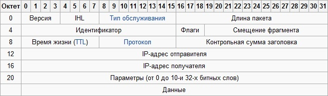

# Internet Protocol \(IPv4\)

**Протокол IP \(Internet Protocol\)** является основным протоколом глобальной компьютерной сети Internet. Полная спецификация протокола описана в [RFC791](http://www.ietf.org/rfc/rfc791.txt).

### Обоснование

Протокол IP создан для использования в объединенных системах компьютерных коммуникационных сетей с коммутацией пакетов. Такие системы были названы "catenet". Примером такой сети является сеть Internet. Internet Protocol обеспечивает передачу блоков данных, называемых датаграммами, от отправителя к получателям, где отправители и получатели являются хост-компьютерами, идентифицируемыми адресами фиксированной длины. Internet Protocol обеспечивает при необходимости также фрагментацию и сборку датаграмм для передачи данных через сети с малым размером пакетов.

### Цель

Протокол IP специально ограничен только задачами обеспечения функций, необходимых для передачи битового пакета \(датаграммы Internet\) от отправителя к получателю через объединенную систему компьютерных сетей. В нем нет механизмов для увеличения достоверности конечных данных, управления протоколом, синхронизации или других услуг, обычно приненяемых в протоколах передачи от хоста к хосту. Internet Protocol может обобщить услуги, поддерживающих его сетей, с целью предоставления услуг различных типов и качеств.

### Интерфейсы

Протокол IP оказывает услуги протоколам транспортного уровня, используемым для передачи информации между хост-компьютерами в сети. В свою очередь Internet Protocol пользуется услугами протоколов физического уровня, вызывая их для передачи датаграммы Internet на следующий шлюз или хост-получатель.

Например, модуль TCP вызывает модуль IP для того, чтобы упаковать TCP-сегмент \(включающий в себя TCP-заголовок и пользовательские данные\) в пакет Internet с целью дальнейшей передачи. В качестве аргументов вызова модуль TCP передает модулю IP сетевые адреса и другие параметры, необходимые для создания датаграммы. После этого протокол IP формирует датаграмму Internet и вызывает протокол локальной сети \(например Ethernet\) для ее передачи.

### Функции

Задачей протокола IP является перемещение дейтаграмм через множество соединенных между собою сетей. Эта задача решается путем передачи дейтаграмм от одного модуля IP к другому, пока дейтаграмма не будет доставлена адресату.

**Модули IP** используются на каждом хосте, участвующем в сети и на каждом маршрутизаторе, соединяющем сети. Эти модули используют общие правила интерпретации полей адреса и фрагментации/сборки дейтаграмм IP. Кроме того, эти модули \(особенно в маршрутизаторах\) выполняют процедуры принятия решения о пересылке дейтаграмм и выполняют еще ряд функций.

Дейтаграммы маршрутизируются от одного модуля IP к другому через промежуточные сети на основе интерпретации адресов IP, соответственно, одним из важнейших механизмов IP является адресация. При маршрутизации сообщений от одного модуля IP к другому может потребоваться передача дейтаграмм через сети, для которых максимальный размер пакета меньше размера дейтаграммы. Для решения этой проблемы протокол IP обеспечивает механизмы фрагментации и сборки дейтаграмм. Таким образом, можно выделить две главные функции протокола IP: **адресацию и фрагментацию**.

### **Адресация**

Для того, чтобы рассматривать адресацию, следует различать имена, адреса и маршруты. Имя указывает объект, который мы видим. Адрес показывает местонахождение, а маршрут говорит, как до него добраться. Протокол IP имеет дело преимущественно с адресами, причем как с логическими, так и с физическими. Именно модуль IP преобразует IP адреса в адреса локальной сети \(при помощи ARP например\). Отображение адресов на имена и обратно является задачей протоколов более высоких уровней \(т. е., транспортного и сеансового\). 

Для выполнения функций адресации каждому узлу сети ставится в соответствие IP-адрес длиной 4 октета \(4 байта\), называемый также логическим адресом. IP-адреса отправителя и получателя помещаются в заголовок протокола IP и используются для поиска пути от отправителя к получателю. Выбор пути передачи называется маршрутизацией. IP-адреса принято записывать разбивкой всего адреса по октетам, каждый октет записывается в виде десятичного числа, числа разделяются точками. Например, адрес:

      10100000010100010000010110000011 - записывается как 10100000.01010001.00000101.10000011 - что в десятичном виде равно 160.81.5.131.

IP-адрес хоста состоит из номера IP-сети, который занимает старшую область адреса, и номера хоста в этой сети, который занимает младшую часть. Положение границы сетевой и хостовой частей \(обычно оно характеризуется количеством бит, отведенных на номер сети\) может быть различным, определяя различные типы IP-адресов. Существует две модели IP-адресации: **классовая \(INET\) и бесклассовая \(CIDR\)**.

**В классовой модели** IP-адрес может принадлежать к одному из четырех классов сетей. Каждый класс характеризуется определенным размером сетевой части адреса, кратным восьми. Таким образом, граница между сетевой и хостовой частями IP-адреса в классовой модели всегда проходит по границе октета. Принадлежность к тому или иному классу определяется по старшим битам адреса.

* **Класс А.** Старший бит адреса равен нулю. Размер сетевой части равен 8 битам. Таким образом, может существовать всего примерно 27 сетей класса А, но каждая сеть обладает адресным пространством на 224 хостов. Так как старший бит адреса нулевой, то все IP-адреса этого класса имеют значение старшего октета в диапазоне 0 - 127, который является также и номером сети.
* **Класс В.** Два старших бита адреса равны 10. Размер сетевой части равен 16 битам. Таким образом, может существовать всего примерно 214 сетей класса В, каждая сеть обладает адресным пространством на 216 хостов. Значения старшего октета IP-адреса лежат в диапазоне 128 - 191, при этом номером сети являются два старших октета.
* **Класс С.** Три старших бита адреса равны 110. Размер сетевой части равен 24 битам. Количество сетей класса С примерно 221, адресное пространство каждой сети рассчитано на 254 хоста. Значения старшего октета IP-адреса лежат в диапазоне 192 - 223, а номером сети являются три старших октета.
* **Класс D**. Сети со значениями старшего октета IP-адреса 224 и выше. Зарезервированы для специальных целей. Некоторые адреса используются для мультикастинга - передачи дейтаграмм группе узлов сети, например:
  *  224.0.0.1 - всем хостам данной сети;
  * 224.0.0.2 - всем маршрутизаторам данной сети;
  * 224.0.0.5 - всем OSPF-маршрутизаторам;
  * 224.0.0.6 - всем выделенным \(designated\) OSPF-маршрутизаторам;

В классе А выделены две особые сети, их номера 0 и 127. Сеть 0 используется при маршрутизации как указание на маршрут по умолчанию и в других особых случаях. IP-интерфейс с адресом в сети 127 используется для адресации узлом себя самого \(loopback, интерфейс обратной связи\). Интерфейс обратной связи не обязательно имеет адрес в сети 127 \(особенно у маршрутизаторов\), но если узел имеет IP-интерфейс с адресом 127.0.0.1, то это - интерфейс обратной связи. Обращение по адресу loopback-интерфейса означает связь с самим собой \(без выхода пакетов данных на уровень доступа к среде передачи\); для протоколов на уровнях транспортном и выше такое соединение неотличимо от соединения с удаленным узлом, что удобно использовать, например, для тестирования сетевого программного обеспечения.

В любой сети \(это справедливо и для бесклассовой модели, которую мы рассмотрим ниже\) все нули в номере хоста обозначают саму сеть, все единицы - адрес широковещательной передачи \(broadcast\).

Например, 194.124.84.0 - сеть класса С, номер хоста в ней определяется последним октетом. При отправлении широковещательного сообщения оно отправляется по адресу 194.84.124.255. Номера, разрешенные для присваивания хостам: от 1 до 254 \(194.84.124.1 - 194.84.124.254\), всего 254 возможных адреса.

Другой пример: в сети 135.198.0.0 \(класс В, номер хоста занимает два октета\) широковещательный адрес 135.198.255.255, диапазон номеров хостов: 0.1 - 255.254 \(135.198.0.1 - 135.198.255.254\).

А теперь предположим, что, в локальной сети, подключаемой к Интернет, находится 2000 компьютеров. Каждому из них требуется выдать IP-адрес. Для получения необходимого адресного пространства нужны либо 8 сетей класса C, либо одна сеть класса В. Сеть класса В вмещает 65534 адреса, что много больше требуемого количества. При общем дефиците IP-адресов такое использование сетей класса В расточительно. Однако если мы будем использовать 8 сетей класса С, возникнет следующая проблема: каждая такая IP-сеть должна быть представлена отдельной строкой в таблицах маршрутов на маршрутизаторах, потому что с точки зрения маршрутизаторов — это 8 абсолютно никак не связанных между собой сетей, маршрутизация дейтаграмм в которые осуществляется независимо, хотя фактически эти IP-сети и расположены в одной физической локальной сети и маршруты к ним идентичны. Таким образом, экономя адресное пространство, мы многократно увеличиваем служебный трафик в сети и затраты по поддержанию и обработке маршрутных таблиц.

**Для решения таких проблем существует бесклассовая модель.** Нет никаких формальных причин проводить границу сеть-хост в IP-адресе именно по границе октета. Это было сделано исключительно для удобства представления IP-адресов и разбиения их на классы. Если выбрать длину сетевой части в 21 бит, а на номер хоста отвести, соответственно, 11 бит, мы получим сеть, адресное пространство которой содержит 2046 IP-адресов, что максимально точно соответствует поставленному требованию. Это будет одна сеть, определяемая своим уникальным 21-битным номером, следовательно, для ее обслуживания потребуется только одна запись в таблице маршрутов. Единственная проблема, которую осталось решить: как определить, что на сетевую часть отведен 21 бит? В случае классовой модели старшие биты IP-адреса определяли принадлежность этого адреса к тому или иному классу и, следовательно, количество бит, отведенных на номер сети. В случае адресации вне классов, с произвольным положением границы сеть-хост внутри IP-адреса, к IP-адресу прилагается 32-битовая маска, которую называют маской сети \(netmask\) или маской подсети \(subnet mask\). Сетевая маска конструируется по следующему правилу: на позициях, соответствующих номеру сети, биты установлены в 1, а на позициях, соответствующих номеру хоста, биты сброшены в 0.

В настоящее время классовая модель считается устаревшей и маршрутизация и \(большей частью\) выдача блоков IP-адресов осуществляются по модели CIDR, хотя классы сетей еще прочно удерживаются в терминологии. Для удобства записи IP-адрес в модели CIDR часто представляется в виде a.b.c.d / n, где a.b.c.d — IP адрес, n — количество бит в сетевой части.

Пример: 137.158.128.0/17.

Маска сети для этого адреса: 17 единиц \(сетевая часть\), за ними 15 нулей \(хостовая часть\), что в октетном представлении равно

11111111.11111111.10000000.00000000 = 255.255.128.0.

Представив IP-адрес в двоичном виде и побитно умножив его на маску сети, мы получим номер сети \(все нули в хостовой части\). Номер хоста в этой сети мы можем получить, побитно умножив IP-адрес на инвертированную маску сети.

Пример: IP = 205.37.193.134/26, или IP = 205.37.193.134 netmask = 255.255.255.192.

Распишем в двоичном виде: IP = 11001101 00100101 11000111 10000110,  маска = 11111111 11111111 11111111 11000000

Умножив побитно, получаем номер сети \(в хостовой части - нули\):

network = 11001101 00100101 11000111 10000000, или 205.37.193.128/26, или 205.37.193.128 netmask 255.255.255.192.

Хостовая часть рассматриваемого IP адреса равна 000110, или 6. Таким образом, 205.37.193.134/26 адресует хост номер 6 в сети 205.37.193.128/26. В классовой модели адрес 205.37.193.134 определял бы хост 134 в сети класса С 205.37.193.0, однако указание маски сети \(или количества бит в сетевой части\) однозначно определяет принадлежность адреса к бесклассовой модели.

И, очевидно, что сети классов А, В, С в бесклассовой модели представляются при помощи масок, соответственно, 255.0.0.0 \(или /8\), 255.255.0.0 \(или /16\) и 255.255.255.0 \(или /24\).

### **Фрагментация** 

Прежде чем рассматривать функцию фрагментации следует отметить, что необходимо различать фрагментацию сообщений в узле-отправителе и динамическую фрагментацию сообщений в транзитных узлах сети - маршрутизаторах. Практически во всех стеках протоколов есть протоколы, которые отвечают за фрагментацию сообщений прикладного уровня на такие части, которые укладываются в кадры канального уровня. В стеке TCP/IP эту задачу решает протокол TCP, который разбивает поток байтов, передаваемый ему с прикладного уровня на сообщения нужного размера \(например, на 1460 байт для протокола Ethernet\). Поэтому протокол IP в узле-отправителе не использует свои возможности по фрагментации пакетов.

А вот при необходимости передать пакет в следующую сеть, для которой размер пакета является слишком большим, IP-фрагментация становится необходимой. В функции уровня IP входит разбиение слишком длинного для конкретного типа составляющей сети сообщения на более короткие пакеты с созданием соответствующих служебных полей, нужных для последующей сборки фрагментов в исходное сообщение. В большинстве типов локальных и глобальных сетей значения MTU, то есть максимальный размер поля данных, в которое должен инкапсулировать свой пакет протокол IP, значительно отличается. Сети Ethernet имеют значение MTU, равное 1500 байт, сети FDDI - 4096 байт, а сети Х.25 чаще всего работают с MTU в 128 байт.

IP-пакет может быть помечен как не фрагментируемый. Любой пакет, помеченный таким образом, не может быть фрагментирован ни при каких условиях. Если же пакет, помеченный как не фрагментируемый, не может достигнуть получателя без фрагментации, то этот пакет просто уничтожается, а узлу-отправителю посылается соответствующее ICMP-сообщение. Также протокол IP допускает возможность использования в пределах отдельной подсети ее собственных средств фрагментирования, невидимых для протокола IP. Например, технология АТМ делит поступающие IP-пакеты на ячейки с полем данных в 48 байт с помощью своего уровня сегментирования, а затем собирает ячейки в исходные пакеты на выходе из сети. Но такие технологии, как АТМ, являются скорее исключением, чем правилом.

Процедуры фрагментации и сборки протокола IP рассчитаны на то, чтобы пакет мог быть разбит на практически любое количество частей, которые впоследствии могли бы быть вновь собраны. Для этих целей в заголовке IP существуют специальные поля, которые дают достаточное количество информации для сборки пакета:

* **Идентификатор.** Получатель фрагмента использует поле идентификации для того, чтобы не перепутать фрагменты различных пакетов. Модуль IP, отправляющий пакет, устанавливает в поле идентификации значение, которое должно быть уникальным для данной пары отправитель - получатель. 
* **Смещение.** Поле смещения фрагмента сообщает получателю положение фрагмента в исходном пакете. Смещение фрагмента и длина определяют часть исходного пакета, принесенную этим фрагментом.
* **Флаги.** Флаг «more fragments», установленный в 1, сообщает о том, что пришел разбитый на фрагменты пакет.  Флаг «more fragments», установленный в 0, показывает появление последнего фрагмента. При отправке не разбитого на фрагменты пакета, устанавливаются 0 во флаге «more fragments» и 0 в поле смещение.

Чтобы разделить на фрагменты большой пакет, протокол IP, например, на маршрутизаторе, создает несколько новых пакетов и копирует содержимое полей IP-заголовка из большого пакета в IP-заголовки всех новых пакетов. Данные из старого пакета делятся на соответствующее число частей, размер каждой из которых, кроме самой последней, обязательно должен быть кратным 8 байт. Размер последней части данных равен полученному остатку. Каждая из полученных частей данных помещается в новый пакет. Когда происходит фрагментация, то некоторые параметры IP-заголовка копируются в заголовки всех фрагментов, а другие остаются лишь в заголовке первого фрагмента. Процесс фрагментации может изменить значения данных, расположенных в поле параметров, и значение контрольной суммы заголовка, изменить значение флага «more fragments» и смещение фрагмента, изменить длину IP-заголовка и общую длину пакета, В заголовок каждого пакета заносятся соответствующие значения в поле смещения «fragment offset», а в поле общей длины пакета помещается длина каждого пакета. 

Чтобы собрать фрагменты пакета, протокол IP объединяет IP-пакеты, имеющие одинаковые значения в полях идентификатора, отправителя, получателя и протокола. Таким образом, отправитель должен выбрать идентификатор таким образом, чтобы он был уникален для данной пары отправитель-получатель, для данного протокола и в течение того времени, пока данный пакет \(или любой его фрагмент\) может существовать в составной IP-сети. Процедура объединения заключается в помещении данных из каждого фрагмента в позицию, указанную в заголовке пакета в поле «fragment offset».

Сценарий действия состоит в том, что модуль Internet меняет размер на каждом из хостов, задействованных в internet-коммуникации и на каждом из шлюзов, обеспечивающих взаимодействие между сетями. Эти модули придерживаются общих правил для интерпретации полей адресов, для фрагментации и сборки Internet датаграмм. Кроме этого, данные модули \(и особенно шлюзы\) имеют процедуры для принятия решений о маршрутизации, а также другие функции.

### **Механизмы протокола IP**

Internet Protocol обрабатывает каждую Internet датаграмму как независимую единицу, не имеющую связи ни с какими другими датаграммами Internet. Протокол не имеет дело ни с соединениями, ни с логическими цепочками \(виртуальными или какими-либо другими\). Для формирования своих услуг он использует четыре ключевых механизма: задание типа сервиса, времени жизни, опций и контрольной суммы заголовка.

* **Тип сервиса \(TOS - Type Of Service\)**. Используется для обозначения требуемой услуги. Тип обслуживания - это абстрактный или обобщенный набор параметров, который характеризует набор услуг, предоставляемых сетями, и составляющих собственно Internet Protocol. Этот способ обозначения услуг должен использоваться шлюзами для выбора рабочих параметров передачи в конкретной сети, для выбора сети, используемой при следующем переходе датаграммы, для выбора следующего шлюза при маршрутизации сетевой Internet датаграммы.
* **Время жизни \(TTL - Time-to-Live\).** Механизм времени жизни служит для указания верхнего предела времени жизни Internet датаграммы. Этот параметр устанавливается отправителем датаграммы и уменьшается в каждой точке на проходимом датаграммой маршруте. Если параметр времени жизни станет нулевым до того, как Internet датаграмма достигнет получателя, эта датаграмма будет уничтожена. Время жизни можно рассматривать как часовой механизм самоуничтожения.
* **Опции \(Options\).** Механизм опций предоставляет функции управления, которые являются необходимыми или просто полезными при определенных ситуациях, однако он не нужен при обычных коммуникациях. Механизм опций предоставляет такие возможности, как временные штампы, безопасность, специальная маршрутизация.
* **Контрольная сумма заголовка \(Header Checksum\).** Обеспечивает проверку того, что информация, используемая для обработки датаграмм Internet, передана правильно. Если контрольная сумма неверна, то Internet датаграмма будет разрушена, как только ошибка будет обнаружена.

Internet Protocol не обеспечивает надежность передации. Не имеется механизма подтверждений ни между отправителем и получателем, ни между хост-компьютерами. Не имеется контроля ошибок для поля данных, только контрольная сумма для заголовка. Не поддерживается повторная передача, нет управления потоком. Обнаруженные ошибки могут быть оглашены посредством протокола ICMP \(Internet Control Message Protocol\), который поддерживается модулем Internet протокола.

### Сценарий работы

Модель передачи дейтаграмм от одной прикладной программы к другой можно проиллюстрировать описанным ниже сценарием. Будем предполагать что передача включает лишь один промежуточный шлюз.

Передающая программа готовит свои данные и вызывает локальный модуль IP для передачи этих данных как дейтаграммы, указывая адрес получателя и другие параметры в качестве аргументов. Модуль IP готовит заголовок дейтаграммы и присоединяет к нему данные. После этого модуль IP определяет локальный сетевой адрес для указанного получателя \(в данном случае это адрес шлюза\). Модуль передает дейтаграмму и локальный адрес локальному сетевому интерфейсу. Интерфейс канального уровня создает заголовок канального уровня и присоединяет к нему дейтаграмму IP, после чего получившийся кадр передается в локальную сеть.

Дейтаграмма приходит на хост-шлюз в кадре канального уровня. Интерфейс канального уровня удаляет заголовок канального уровня и передает дейтаграмму модулю IP. Модуль IP определяет на основе IP-адреса, что дейтаграмму следует переслать хосту другой сети. Тогда модуль IP определяет адрес канального уровня для пересылки дейтаграммы получателю и вызывает интерфейс канального уровня той сети, куда будет передаваться дейтаграмма. Интерфейс канального уровня создает заголовок и, присоединив к нему дейтаграмму, передает получившийся кадр хосту-адресату. 

На хосте получателя дейтаграмма выделяется из кадра интерфейсом канального уровня и передается модулю IP. Модуль IP определяет по заголовку, что дейтаграмма адресована приложению на данном хосте и передает прикладной программе данные из дейтаграммы вместе с адресом отправителя и другими параметрами в ответ на системный вызов.

                                      **Путь передачи данных**

Прикладная программа                                          Прикладная программа  
                \                                                                                  /  
          модуль IP                       модуль IP                          модуль IP  
                   \                             /             \                               /  
                 LNI-1                    LNI-1         LNI-2                    LNI-2  
                      \                       /                   \                        /  
                     Локальная сеть 1              Локальная сеть 2                                 

#### 6. Формат пакета IP 

Заголовок дейтаграмм internet имеет следующий формат: 

* **Версия** - 4 бита. Это поле указывает номер версии протокола и определяет формат заголовка. Данная спецификация описывает версию 4.
* **IHL** - 4 бита. Это поле содержит размер заголовка IP в 32-битовых словах и указывает на начало данных. Отметим, что минимальное значение этого поля для корректного заголовка составляет 5.
* **Тип обслуживания \(ToS\)** - 8 бит. Поле ToS обеспечивает индикацию абстрактных параметров желаемого качества обслуживания. Это значение используется при выборе реальных параметров обслуживания в процессе передачи дейтаграммы через отдельную сеть. Некоторые сети предлагают приоритетный сервис, который тем или иным способом трактует трафик с большим уровнем предпочтения как более важный, нежели трафик другого типа \(обычно при высокой загрузке просто воспринимается только трафик с уровнем предпочтения выше некоторого порога\). Основной выбор осуществляется между тремя вариантами — малая задержка, высокая надежность, высокая пропускная способность. Побитно:
  * биты 0,1,2 - предпочтения \(Precedence\)
    * 111 - управление сетью
    * 110 - межсетевое управление
    * 101 - CRITIC/ECP
    * 100 - сверхсрочно
    * 011 - срочно
    * 010 - незамедлительно
    * 001 - приоритетный
    * 000 - обычный
  * бит 3 - задержка \(Delay\): 0 = обычная, 1 = малая
  * бит 4 - пропускная способность \(Throughput\): 0 = обычная, 1 = высокая
  * бит 5 - надежность \(Reliability\): 0 = обычная, 1 = высокая
  * биты 6,7 - ECN \(Explicit Congestion Notification\) - явное сообщение о перегрузке \(управление IP-потоком\)
    * 00 - поток не поддерживающий ECN \(Not-ECN-Capable Transport \(Not-ECT\)\) 
    * 01, 10 - поток поддерживающий ECN \(ECN-Capable Transport \(ECT\)\)
    * 11 - подтвержденная перегрузка \(Congestion Experienced \(CE\)\)

Использование флагов Delay, Throughput, Reliability может увеличивать стоимость \(в том или ином смысле\) обслуживания. Во многих сетях предпочтение по одному из этих           параметров может быть связано с потерями по другому. За исключением специальных случаев следует использовать не более двух флагов из 3 возможных. 

* **Длина пакета** - 16 бит. Это поле указывает общий размер \(в октетах\) дейтаграммы с учетом заголовка и данных. Размер этого поля позволяет создавать дейтаграммы длиной до 65 535 октетов. Столь большие дейтаграммы неприемлемы для большинства хостов и сетей. Все хосты должны быть готовы к восприятию дейтаграмм размером до 576 октетов \(целиком или в виде фрагментов\). Хостам рекомендуется передавать дейтаграммы, размер которых превышает 576 октетов только в тех случаях, когда есть уверенность, что адресат может принимать такие дейтаграммы. Значение 576 выбрано для того, чтобы дейтаграммы могли кроме заголовка содержать блок данных разумных размеров. Например, такой размер позволяет передавать блок данных размером 512 октетов с 64-октетным заголовком. Максимальный размер заголовка IP составляет 60 октетов, а размер типичного заголовка IP — 20 октетов, что оставляет достаточно места для заголовков вышележащих уровней.
* **Идентификатор** - 16 бит. Значение поля идентификации присваивается отправителем для обеспечения корректной сборки фрагментов дейтаграммы.
* **Флаги** - 3 бита. Набор флагов управления.
  * Бит 0 - зарезервирован \(должен иметь значение 0\)
  * Бит 1 - возможность фрагментации \(DF \(don’t fragment\)\): 0 = фрагментация возможна, 1 = фрагментация недопустима
  * Бит 2 - определение последнего фрагмента \(MF \(more fragments\)\): 0 = последний фрагмент, 1 = фрагмент не является последним
* **Смещение фрагмента** - 13 бит. Это поле показывает положение данного фрагмента в исходной дейтаграмме. Смещение измеряется в единицах, кратных 8 октетам \(64 бита\). Смещение первого фрагмента равно нулю.
* **Время жизни \(TTL\)** - 8 бит. Это поле определяет максимальный срок существования дейтаграммы в системе internet. Дейтаграммы с нулевым значением времени жизни должны уничтожаться. Значение этого поля изменяется при обработке заголовков IP. Время измеряется в секундах, но, поскольку каждый обрабатывающий дейтаграмму модуль должен уменьшать значение TTL, по крайней мере, на 1 \(даже если обработка длилась меньше секунды\), значение TTL следует рассматривать как верхний предел срока жизни дейтаграммы в систем. Это поле введено для того, чтобы можно было избавиться от недоставленных дейтаграмм.
* **Протокол** - 8 бит. Это поле указывает протокол следующего уровня, содержащийся в поле данных дейтаграммы IP. Идентификаторы протоколов можно посмотреть в вики [http://ru.wikipedia.org/wiki/Список\_интернет-протоколов\_транспортного\_уровня](http://ru.wikipedia.org/wiki/%D0%A1%D0%BF%D0%B8%D1%81%D0%BE%D0%BA_%D0%B8%D0%BD%D1%82%D0%B5%D1%80%D0%BD%D0%B5%D1%82-%D0%BF%D1%80%D0%BE%D1%82%D0%BE%D0%BA%D0%BE%D0%BB%D0%BE%D0%B2_%D1%82%D1%80%D0%B0%D0%BD%D1%81%D0%BF%D0%BE%D1%80%D1%82%D0%BD%D0%BE%D0%B3%D0%BE_%D1%83%D1%80%D0%BE%D0%B2%D0%BD%D1%8F).
* **Контрольная сумма заголовка \(Header Checksum\)** - 16 бит. Контрольная сумма полей заголовка. Поскольку некоторые поля заголовка \(например, TTL\) изменяются в процессе доставки, значение контрольной суммы проверяется и вычисляется заново в каждой точке обработки заголовков IP. Контрольная сумма заголовка представляет собой 16-битовое поразрядное дополнение \(one's complement\) суммы поразрядных дополнений всех 16-битовых слов заголовка. При вычислении контрольной суммы значение самого поля принимается нулевым. Контрольную сумму легко посчитать и можно показать ее адекватность, но алгоритм вычисления контрольной суммы может быть заменен специальной процедурой CRC с учетом опыта использования.
* **IP-адрес отправителя** - 32 бита. Логический адрес отправителя.
* **IP адрес получателя** - 32 бита. Логический адрес получателя. 
* **Параметры \(опции\)** - переменная длина от 0 до 10-и 32-х битных слов. Поле опций является необязательным. Поддержка опций должна реализоваться во всех модулях IP \(на хостах и шлюзах\). Использование опций определяется для отдельной дейтаграммы, а не для реализации модуля. В некоторых средах использование опций безопасности является обязательным. Поле опций имеет переменную длину. Существует два варианта форматирования опций:
  * однооктетные опции
  * октет типа опции, октет размера опции и октеты собственно опций \(поле размера опции учитывает поля типа, размера и данных опции\). Октет типа опции содержит три поля:
    * флаг копирования \(1 бит\) - показывает, что данная опция копируется во все фрагменты дейтаграммы: 
      * 0 - опция не копируется
      * 1 - опция копируется во фрагменты
    * класс опции \(2 бита\) - может принимать 4 значения:
      * 0 — управление
      * 1 — зарезервирован
      * 2 — отладка и измерения
      * 3 — зарезервирован
    * номер опции \(5 битов\).

Определены следующие номера опций IP:

| Класс | Номер | Длина | Описание |
| :--- | :--- | :--- | :--- |
| 0 | 0 | - | Конец списка опций \(End of Option list\). Эта опция занимает только 1 октет и не использует поле длины |
| 0 | 1 | - | Нет операции. Эта опция занимает только 1 октет и не использует поле длины |
| 0 | 2 | 11 | Безопасность \(Security\). Используется для передачи опций Security \(безопасность\), Compartmentation \(изоляция\), User Group \(TCC\), Handling Restriction Codes \(коды управления ограничениями\), совместимых с требованиями DOD |
| 0 | 3 | переменная | Loose Source Routing \(нестрогое задание маршрута отправителем\). Используется для маршрутизации дейтаграмм IP с учетом данных, указанных отправителем |
| 0 | 9 | переменная | Strict Source Routing \(строгое задание маршрута отправителем\). Используется для маршрутизации дейтаграмм IP на основе данных, указанных отправителем |
| 0 | 7 | переменная | Record Route \(запись маршрута\). Используется для трассировки пути дейтаграмм IP |
| 0 | 8 | 4 | Stream ID \(идентификатор потока\). Используется для обозначения потоков дейтаграмм |
| 2 | 4 | переменная | Internet Timestamp \(временная метка\) |

#### 7. Зарезервированные IP адреса и маршрутизация 

Некоторые адреса IPv4 зарезервированы для специальных целей и не предназначены для глобальной маршрутизации

| Подсеть | Назначение |
| :--- | :--- |
| 0.0.0.0/8 | Адреса источников пакетов «этой» \(«своей»\) сети, предназначены для локального использования на хосте при создании сокетов IP. Адрес 0.0.0.0/32 используется для указания адреса источника самого хоста |
| 10.0.0.0/8 | Для использования в частных сетях |
| 127.0.0.0/8 | Подсеть для коммуникаций внутри хоста \(localhost\) |
| 169.254.0.0/16 | Подсеть используется для автоматического конфигурирования адресов IP в случае отсутствия сервера DHCP |
| 172.16.0.0/12 | Для использования в частных сетях |
| 100.64.0.0/10 | Для использования в сетях сервис-провайдера |
| 192.0.0.0/24 | Регистрация адресов специального назначения |
| 192.0.2.0/24 | Для примеров в документации |
| 192.168.0.0/16 | Для использования в частных сетях |
| 198.51.100.0/24 | Для примеров в документации |
| 198.18.0.0/15 | Для стендов тестирования производительности |
| 203.0.113.0/24 | Для примеров в документации |
| 240.0.0.0/4 | Зарезервировано для использования в будущем |
| 255.255.255.255 | Ограниченный широковещательный адрес |

Есть также зарезервированные адреса, которые маршрутизируются глобально.

| Подсеть | Назначение |
| :--- | :--- |
| 192.88.99.0/24 | Используются для рассылки ближайшему узлу. Адрес 192.88.99.1/32 применяется в качестве ретранслятора при инкапсуляции IPv6 в IPv4 \(6to4\) |
| 224.0.0.0/4 | Используются для многоадресной рассылки. |

**Процесс маршрутизации дейтаграмм** состоит в определении следующего узла \(next hop\) в пути следования дейтаграммы и пересылки дейтаграммы этому узлу, который является либо узлом назначения, либо промежуточным маршрутизатором, задача которого - определить следующий узел и переслать ему дейтаграмму. Ни узел-отправитель, ни любой промежуточный маршрутизатор не имеют информации о всей цепочке, по которой пересылается дейтаграмма; каждый маршрутизатор, а также узел-отправитель, основываясь на адресе назначения дейтаграммы, находит только следующий узел ее маршрута.

Маршрутизация дейтаграмм осуществляется на уровне протокола IP на основе данных, содержащихся в таблице маршрутов. Строка в таблице маршрутов состоит из следующих полей: адрес сети назначения; адрес следующего маршрутизатора \(то есть узла, который знает, куда дальше отправить дейтаграмму, адресованную в сеть назначения\); вспомогательные поля \(номер выходного порта, метрика и др.\). Таблица может составляться вручную или с помощью специализированных протоколов. Каждый узел сети, в том числе и хост, имеет таблицу маршрутов, хотя бы самую простую.

**Статическая маршрутизация** - вид маршрутизации, при котором маршруты указываются в явном виде при конфигурации маршрутизатора. Вся маршрутизация при этом происходит без участия каких-либо протоколов маршрутизации. При задании статического маршрута указываются:

* адрес сети \(на которую маршрутизируется трафик\), маска сети
* адрес шлюза \(узла\), который отвечает за дальнейшую маршрутизацию \(или подключен к маршрутизируемой сети напрямую\)
* \(опционально\) метрика \(иногда именуется также "ценой"\) маршрута. При наличии нескольких маршрутов на одну и ту же сеть некоторые маршрутизаторы выбирают маршрут с минимальной метрикой.

В некоторых маршрутизаторах возможно указывать интерфейс, на который следует направить трафик сети и указать дополнительные условия, согласно которым выбирается маршрут \(например, SLA в маршрутизаторах cisco\).

Достоинства статической маршрутизации:

* Лёгкость отладки и конфигурирования в малых сетях.
* Отсутствие дополнительных накладных расходов \(из-за отсутствия протоколов маршрутизации\)
* Мгновенная готовность \(не требуется интервал для конфигурирования/подстройки\)
* Низкая нагрузка на процессор маршрутизатора
* Предсказуемость в каждый момент времени

Недостатки:

* Очень плохое масштабирование \(добавление \(N+1\)-ой сети потребует сделать 2\*\(N+1\) записей о маршрутах, причём на большинстве маршрутизаторов таблица маршрутов будет различной, при N&gt;3-4 процесс конфигурирования становится весьма трудоёмким\).
* Низкая устойчивость к повреждениям линий связи \(особенно, в ситуациях, когда обрыв происходит между устройствами второго уровня и порт маршрутизатора не получает статус down\).
* Отсутствие динамического балансирования нагрузки
* Необходимость в ведении отдельной документации к маршрутам, проблема синхронизации документации и реальных маршрутов.

В реальных условиях статическая маршрутизация используется в условиях наличия шлюза по умолчанию \(узла, обладающего связностью с остальными узлами\) и 1-2 сетями. Помимо этого статическая маршрутизация используется для "выравнивания" работы маршрутизирующих протоколов в условиях наличия туннеля \(для того, чтобы маршрутизация трафика, создаваемого туннелем, не производилась через сам туннель\).

