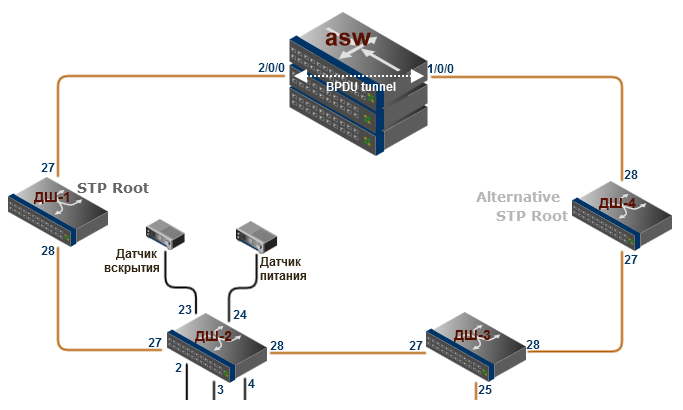
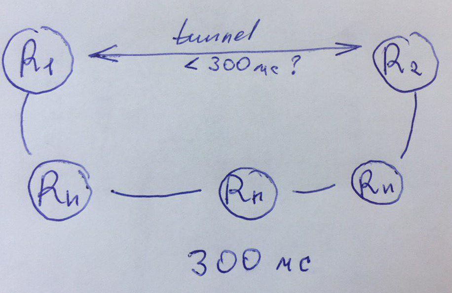

# Вопросы которые меня тревожат

### 1 Ограничение стекового кабеля

Почему в кольце между МКУ и ASW нельзя \(не нужно\) поднять LACP при использовании STP ?

### 2 Разница задержки на транспорте и в туннеле

Есть транспортная сеть, на ней задержка между R1 и R2 равна допустим 300мс. Если мы поднимем туннель поверх этого транспорта, может ли быть такое что задержка уменьшится ?  
Да, физика вся остается той же. Есть такое, что пока поднят туннель, устанавливается какая-то сессия и маршрутизаторам не приходится снова что то пересчитывать \(куда пересылать пакеты\) или что нибудь  в этом роде ?

### 3 Опасны ли радиомосты Wi-Fi \(indoor\outdoor\) или Eband для здоровья?

### 4 Почему для организации подключения по топологии Point-to-Point категорически запрещается использовать Ubiquiti NanoStation M2, Ubiquiti Loco M2?

### 5 Выборы DR/BDR происходят только в multi-access сети. Если у всех маршрутизаторов выставить приоритет равным нулю - возникнут проблемы рассылки копий LSA ? В hello-пакетах хранятся определенные параметры, благодаря которым устанавливается состояние смежности и договоренность соседей. Так же протокол hello выбирает DR и BRD. Если заблокировать рассылку hello-пакетов, то состояние смежности не установится, соответственно возникает вопрос - OSPF вообще будет функционировать?

