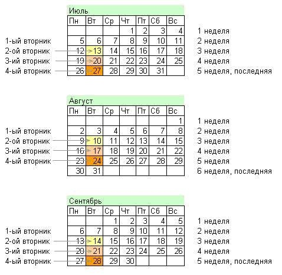

# Перечень и графики проведения ППР

### **Перечень ППР** 

Начните добавлять фильтры в меню инструментов фильтрации.

| **№** | **Периодичность** | День создания ППР в Jira | **Название ППР** | **Выполняется: для ЦГС** | **для ПГС∗** | **для УГС/ПГС \(ДШ\)∗∗** | **для МУП \(термошкаф\)∗∗∗** |
| :--- | :--- | :--- | :--- | :--- | :--- | :--- | :--- |
| 1 | Еженедельно | Каждый понедельник | Доступ в аппаратную | **+** | **+** |  |  |
| 2 | Ежеквартально | Последний вторник месяца | Фотографирование | **+** | **+** | **+** | **+** |
| 3 | Ежеквартально | 2 Понедельник  3 месяца в квартале | Измерения на резервном оборудовании КТВ | **+** |  |  |  |
| 4 | Ежемесячно | 4 вторник месяца | Актуализация данных в системе управления и паспорте города | **+** |  |  |  |

**Примечание:**

**∗** - для ПГС и резервных аппаратных, где _резервная аппаратная_ - помещение \(ПГС, офис\), в котором располагается оборудование, резервирующее работу основного оборудования, установленного на ЦГС.  
**∗∗** - для УГС/ПГС/МУП, расположенных в ДШ на чердаках, в предлифтовых и т.п.  
**∗∗∗** - для МУП нового типа, представляющих собой напольный термошкаф с встроенными кондиционерами.

### **Проверка ППР** 

**1- 2** - Инженерами Службы поддержки регионального управления сетью

**3, 4** - Межрегиональными инженерами аналогового и цифрового КТВ согласно списка: Распределение МрИ по филиалам и подсистемам

### **Дни и недели проведения ППР** 

Номер дня недели и номер недели – это расположение в календаре.

Например, в июле до 6 числа вторников не было, т.е. 6 июля – это первый вторник, соответственно 13 июля – второй вторник, 20 июля – третий вторник, 27 июля - четвертый вторник.

С неделями аналогично. В первой строке календаря располагаются числа – с 1 по 4 июля – это первая неделя, соответственно с 5 по 11 июля – это вторая неделя и т.д.

**ППР считается выполненным, если:**

* задача отработана в срок указанный в задаче JIRA, либо до окончательного срока выполнения, и находится в статусе **"ПРОВЕРЕНО"**
* приложены все необходимые отчёты и комментарии.

