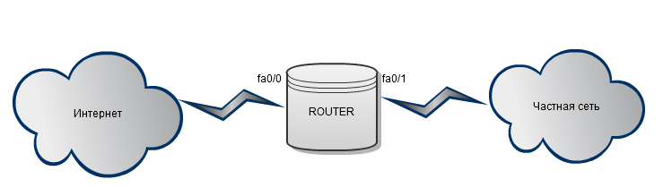

# ACL

**ACL \(Access Control List\)** — это набор текстовых выражений \(инструкций\), которые указывают устройству какой трафик нужно разрешить, а какой запретить. Обычно ACL разрешают или запрещает IP-пакеты, но помимо этого они могут заглядывать внутрь IP-пакета, просматривать тип пакета, TCP и UDP порты. Также ACL существуют для различных сетевых протоколов \(IP, IPX, AppleTalk и так далее\). В основном применение списков доступа рассматривают с точки зрения пакетной фильтрации, которая необходима в тех ситуациях, когда существует оборудование, установленное на границе Интернет и частной сети, и необходимо отфильтровать ненужный трафик.

Функционал ACL состоит в классификации трафика, необходимо сначала проверить трафик, а потом уже что-то с ним сделать в зависимости от того, где ACL применяется, например:

* На интерфейсе: пакетная фильтрация
* На линии Telnet: ограничения доступа к маршрутизатору
* VPN: какой трафик нужно шифровать
* QoS: какой трафик обрабатывать приоритетнее
* NAT: какие адреса транслировать

Применительно к пакетной фильтрации, ACL размещаются на интерфейсах, сами они создаются независимо, а уже потом применяются к нужным интерфейсам. После того как на интерфейсе был применен ACL, маршрутизатор начинает разбирать трафик, проходящий через этот интерфейс. Тот трафик, который входит в маршрутизатор называется входящим, тот который из него выходит — исходящим. Соответственно ACL размещаются на входящем или на исходящем направлении.

Например, на рисунке выше, из частной сети приходит пакет на интерфейс маршрутизатора fa0/1, маршрутизатор проверяет есть ли ACL на этом интерфейсе, и, если он есть, начинает обработку по правилам списка доступа строго в том порядке, в котором они записаны. Если список доступа разрешает проходить пакету, то, в данном случае, маршрутизатор отправляет пакет на интерфейс fa0/0, если же список доступа не разрешает проходить пакету, то пакет уничтожается. Ну и очевидно, что если списка доступа нет, то пакет пролетает без всяких ограничений. Далее, перед тем как отправить пакет провайдеру, маршрутизатор точно также проверяет есть ли ACL на интерфейсе fa0/0.

Теперь рассмотрим пример использования ACL. Предположим, что на маршрутизаторе существует ACL с правилом, запрещающим всем узлам в Интернете посылать пакеты в частную сеть. Возникает первый вопрос - на каком интерфейсе применить данный ACL? Если применить его для исходящего трафика на интерфейсе fa0/1, то ACL будет работать, но это будет не совсем верно. Например, на маршрутизатор приходит не запрошенный пакет для какого-нибудь узла в частной сети, маршрутизатор не находит ACL на интерфейсе fa0/0 и отправляет пакет дальше на интерфейс fa0/1, на котором есть ACL, запрещающий такой исходящий трафик, соответственно только на этом этапе пакет уничтожается маршрутизатором. Но если применить данный ACL для входящего трафика на интерфейсе fa0/0, то пакет будет уничтожаться сразу как пришел на маршрутизатор, это и будет правильным решением, так как маршрутизатор будет меньше нагружать свои вычислительные ресурсы. Существует правило, что расширенные ACL нужно размещать как можно ближе к источнику, стандартные же как можно ближе к получателю. Это нужно для того, чтобы не гонять пакеты по всей сети зря. Таким образом, мы подошли к типам ACL.

### **Существует два основных типа ACL:**

* Стандартные \(Standard\) - могут проверять только адреса источников \(для оборудования Cisco\)
* Расширенные \(Extended\) - могут проверять адреса источников, а также адреса получателей, в случае IP ещё тип протокола и TCP/UDP порты

Обозначаются списки доступа либо номерами, либо символьными именами \(именованные списки доступа\).

* За стандартными ACL закреплены номера 1-99, 1300-1999 для оборудования Cisco и 2000-2999 для оборудования Huawei
* За расширенными – 100-199; 2000-2699 для оборудования Cisco и 3000-3999 для оборудования Huawei
* Для именованных ACL может использоваться любое имя, выбранное администратором. Использование именованных ACL более удобно. Во-первых, для идентификации ACL используется имя, по которому можно понять для чего используется ACL, а не номер. Во-вторых, в именованных листах используется собственный конфигурационный режим, позволяющий более удобно редактировать ACL.

Сам же ACL представляет собой набор правил, в которых заданы действия permit \(разрешить\) или deny \(запретить\). Обработка ведется строго в том порядке, в котором заданы правила. Как только находится правило, под которое попадает обрабатываемый пакет, дальнейшая его обработка прекращается. Пакет либо перейдет дальше, либо уничтожится. Если пакет не попадает ни под какое правило, то он так же уничтожается по причине того, что в конце каждого списка стоит неявный deny any \(запретить весь трафик\) \(справедливо для Cisco и Huawei, у других вендоров бывает по другому\). При создании ACL каждое правило списка доступа обозначается порядковым номером, по умолчанию в рамках десяти \(10, 20, 30 и т.д\). Благодаря чему, можно удалить конкретную запись и на её место вставить другую. Существуют правила, что:

* Нельзя разместить более одного списка доступа на интерфейс, на протокол, на направление. То есть на один интерфейс маршрутизатора, на входящее направление для IP-протокола можно разместить только один список доступа, например под номером 10.
* И правило, касающееся маршрутизаторов, - ACL не действует на трафик, сгенерированный самим маршрутизатором.

Для фильтрации адресов в ACL используется **WildCard-маска**. Это обратная маска, вычисляется она следующим способом: берем шаблонное выражение 255.255.255.255 и отнимаем от него обычную маску. Например, 255.255.255.255 - 255.255.255.0 = 0.0.0.255. Полученная маска 0.0.0.255 является WildCard-маской для 255.255.255.0. Также, если представить обратную маску в двоичном виде, то можно сказать, что 0 биты – определяют какая часть IP адреса должна совпадать с ACL, а 1 биты – определяют какая часть IP адреса может отличаться. Но на самом деле не все так просто. Обратная маска — это очень богатый инструмент, который позволяет объединять адреса внутри одной подсети или объединять подсети, но самое главное он позволяет чередовать нули и единицы для того, чтобы, например, отфильтровать определённый узел \(или группу\) в нескольких подсетях одной строкой. Примеры использования:

* Пример 1

Дано: сеть 172.16.16.0/24

Надо: отфильтровать первые 64 адреса \(172.16.16.0-172.16.16.63\)

Решение: 172.16.16.0 0.0.0.63

* Пример 2

Дано: сети 172.16.16.0/24 и 172.16.17.0/24

Надо: отфильтровать адреса из обеих сетей

Решение: 172.16.16.0 0.0.1.255

* Пример 3

Дано: Сети 172.16.0.0-172.16.255.0

Надо: отфильтровать хост с адресом 4 из всех подсетей

Решение: 172.16.16.0 0.0.255.4

Более подробно об обратных масках можно прочитать тут: [http://habrahabr.ru/post/131712/](http://habrahabr.ru/post/131712/)

### **Также существует несколько видов ACL, которые в том или ином исполнении присутствуют на оборудовании различных вендоров.**

* Динамический \(Dynamic ACL\)

Используется, например, в том случае, когда за маршрутизатором находится сервер, к которому нужно закрыть доступ к нему из внешнего мира, но при этом дать доступ к этому серверу для нескольких пользователей. Для решения этой задачи настраивается динамический список доступа, который применяется на входящем направлении. Настраивается он таким образом, что пользователям, желающим попасть на сервер, сначала необходимо, например, подключиться через Telnet к данному маршрутизатору, после этого динамический ACL открывает доступ к серверу, и пользователи уже могут подключаться к этому серверу. По умолчанию через 10 минут этот доступ закрывается и пользователи вынуждены ещё раз подключаться через Telnet.

* Рефлексивный \(Reflexive ACL\)

Используется для блокирования всего трафика, кроме трафика пользовательских сессий. Когда узел в локальной сети отправляет TCP запрос в Интернет, то необходимо наличие открытого канала, чтобы пришел TCP ответ для установки соединения. Если такого канала не будет, то будет невозможно установить соединение, но именно этим открытым каналом могут воспользоваться злоумышленники. Рефлексивные ACL работают таким образом, что полностью блокируют доступ \(deny any\), но при этом формируют ещё один специальный ACL, который может читать параметры пользовательских сессий, сгенерированных из локальной сети, и открывать для них доступ в deny any. В результате получается что из Интернета установить соединение невозможно, а на сессии, сгенерированные из локальной сети, будут приходить ответы.

* Ограничение по времени \(Time-based ACL\)

По сути это обычный ACL, но с ограничением по времени. Можно задать специальное расписание, которое активирует ту или иную запись списка доступа. Например, можно создать список доступа, в котором запрещается HTTP-доступ в течении рабочего дня, чтобы сотрудники компании работали, а не сидели в интернетах. \(Очень жестоко по-моему\)\)\).

### **Итак, в итоге можно сказать, что для того, чтобы правильно сконфигурировать ACL нужно выполнить 4 основных пункта:**

* Определить требования к фильтрации
* Выбрать необходимый тип ACL
* Определить интерфейсы для применения ACL
* Определить направления фильтрации

