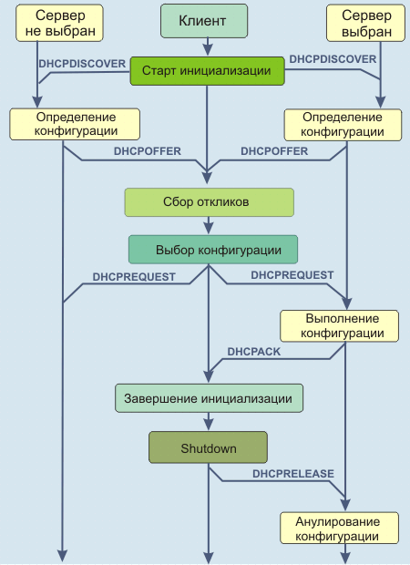
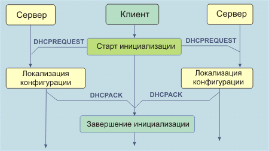

# DHCP

**Протокол динамической конфигурации DHCP** \(Dynamic Host Configuration Protocol\) служит для предоставления конфигурационных параметров для ПК, подключенных к Интернет.

DHCP построен по схеме клиент-сервер, где DHCP-сервер выделяет сетевые адреса и доставляет конфигурационные параметры динамически конфигурируемым ПК.

После получения через DHCP необходимых параметров, клиент DHCP должен быть готов к обмену пакетами с любой другой ПК в Интернет. Не все эти параметры необходимы для первичной инициализации клиента. Клиент и сервер могут согласовывать список необходимых параметров.

### DHCP поддерживает три механизма выделения IP-адресов:

* Автоматическое - присваивает клиенту постоянный IP-адрес.
* Динамическое - присваивает клиенту IP-адрес на ограниченное время.
* Ручное - IP-адрес выделяется клиенту сетевым администратором, а DHCP используется просто для передачи адреса клиенту.

Динамическое присвоение адресов представляет собой единственный механизм, который позволяет автоматически повторно использовать адрес, который не нужен клиенту, является оптимальной схемой для клиентов, подключаемых к сети временно, или совместно использующих один и тот же набор IP-адресов и не нуждающихся в постоянных адресах.

Формат сообщений DHCP базируется на формате сообщений BOOTP. Агент транспортировки BOOTP может передать сообщение DHCP-серверам, которые размещены за пределами данной физической субсети, что исключает необходимость наличия DHCP-серверов в каждом физическом сегменте сети.

Протокол DHCP позволяет, но не требует конфигурации параметров клиента, не имеющих прямого отношения к IP-протоколу. DHCP не обращается к системе DNS для регистрации адреса . DHCP не может использоваться для конфигурации маршрутизаторов.

DHCP должен:

* Гарантировать, что любой специфический сетевой адрес не будет использоваться более чем одним клиентом DHCP одновременно.
* Поддерживать DHCP конфигурацию клиента при стартовой перезагрузке DHCP-клиента, по мере возможности, присваиваться один и тот же набор конфигурационных параметров.
* Позволять автоматически присваивать конфигурационные параметры новым клиентам, чтобы избежать ручной конфигурации.
* Поддерживать фиксированное или постоянное присвоение конфигурационных параметров для заданного клиента.

### **Сервисы предоставляемые DHCP:**

1.  Запоминание сетевых параметров для клиента

Модель DHCP памяти состоит из записей «ключ – значение» для каждого клиента, где ключ представляет собой некоторый уникальный идентификатор, а значение содержит набор конфигурационного параметров клиента. Примеры ключей: адрес подсети+MAC адрес, адрес подсети+имя ПК, либо клиент может задать идентификатор в явном виде \('client identifier'\). Интерфейс клиента к депозитарию конфигурационных параметров реализуется с помощью протокольных сообщений запроса и откликов серверов, несущих в себе конфигурационные параметры.

 2.  Выделение клиенту сетевого \(IP\) адреса

Основной механизм для динамического присвоения сетевых адресов: клиент запрашивает использование адреса на определенный период времени. Механизм выделения адреса \(ассоциация DHCP-серверов\) гарантирует, что адрес в течение оговоренного времени не будет использован для других целей, и пытается прислать тот же сетевой адрес всякий раз, когда клиент его запрашивает. Клиент может расширить это время последующими запросами. Клиент может послать серверу сообщение об освобождении адреса, когда клиент более не нуждается в этом адресе. Клиент может запросить постоянное присвоение адреса, потребовав бесконечное значение времени выделения адреса. Даже при "постоянном" выделении адресов, сервер может определить большой, но не бесконечный срок аренды адреса, чтобы позволить детектирование факта, что клиент перестал работать.

При некоторых обстоятельствах может оказаться необходимым повторно присваивать сетевые адреса из-за отсутствия свободных адресов. При таких условиях, механизм выделения будет повторно присваивать адреса, чье время действительности истекло. Сервер должен использовать информацию, которая доступна в конфигурационном депозитарии, чтобы выбрать адрес, который может быть использован повторно. Например, сервер может выбрать последний из присвоенных адресов. В качестве проверки совместимости сервер должен проверить повторно используемые адреса, прежде чем их повторно пускать в оборот. Это может быть, например, контроль посредством ICMP эхо-запроса, а клиент должен проверить вновь полученный адрес, например, посредством ARP.

### **Взаимодействие клиента и сервера при выделении сетевого адреса.**

1. Клиент широковещательно пересылает сообщение DHCPDISCOVER по локальной подсети.

2. Каждый сервер может откликнуться сообщением DHCPOFFER, которое содержит сетевой адрес в поле 'yiaddr'. При выделении нового адреса сервер проверяет, чтобы предлагаемый сетевой адрес не использовался где-то еще \(например ICMP запросом\); сетевые администраторы могут выбрать тесты выдаваемых адресов. После этого сервер отправляет клиенту сообщение DHCPOFFER.

3. Клиент получает ответ DHCPOFFER от серверов и выбирает один, согласно содержащемуся в ответе предложению. Затем широковещательно отправляет сообщение DHCPREQUEST, в котором указываются  выбранный сервер \('server identifier'\), желательные конфигурационные значения.  Сообщение DHCPREQUEST должно использовать то же значение поля 'secs' заголовка DHCP-сообщения и должно посылаться по тому же широковещательному IP-адресу, что и оригинальное сообщение DHCPDISCOVER.

Клиент реализует таймаут и повторно посылает сообщение DHCPDISCOVER, если не получает сообщений DHCPOFFER.

4. Выбранный сервер, после получения DHCPREQUEST, записывает конфигурационный набор клиента в постоянную память и реагирует сообщением DHCPACK, содержащим конфигурационные параметры для приславшего запрос. Любые конфигурационные параметры в сообщении DHCPACK не должны конфликтовать с параметрами из сообщения DHCPOFFER, на которое клиент откликается. В поле 'yiaddr' сообщений DHCPACK записывается выбранный сетевой адрес.

Если выбранный сервер не может адекватно реагировать на сообщение DHCPREQUEST \(например, запрошенный сетевой адрес уже выделен\), он отсылает сообщение DHCPNAK.

Если сервер не получил DHCPREQUEST, он помечает адрес, предложенный клиенту в сообщении DHCPOFFER, как доступный.

Не выбранные серверы используют сообщение DHCPREQUEST, как уведомления о том, что клиент отверг предложение.

5. После получения DHCPACK выполняет окончательную проверку параметров \(например, запустить ARP для выделенного сетевого адреса\), и фиксирует длительность предоставления конфигурационных параметров, прописанную в сообщении DHCPACK. С этого момента клиент считается сконфигурированным.

Если клиент обнаруживает, что адрес уже используется, он посылает серверу сообщение DHCPDECLINE и повторно запускает процесс конфигурации после таймаута.

Если клиент получает сообщение DHCPNAK, он перезапускает конфигурационный процесс.

Если клиент не получает ни сообщения DHCPACK ни DHCPNAK, он повторно отправляет сообщение DHCPREQUEST после таймаута.

6. Клиент может решить отказаться от аренды сетевого адреса с помощью 'идентификатора клиента', или 'chaddr' и сетевого адреса в сообщении DHCPRELEASE

Заметим, что в случае, когда клиент сохраняет свой сетевой адрес локально, при корректном прерывании сессии \(shutdown\) он не должен отказываться от конфигурационного набора.

### **Взаимодействие клиента и сервера при повторном использовании ранее выделенных сетевых адресов**

Если клиент помнит и желает использовать выделенный ранее сетевой адрес, он может опустить 1, 2 шаги, рассмотренные в предыдущем разделе и начать с широковещательной рассылки DHCPREQUEST. Причем сообщения DHCPACK или DHCPNAK отсылают только те сервера, которые владеют актуальной информацией для запрашиваемой конфигурации.

Если запрос клиента не корректен \(например, клиент переместился в другую субсеть\), серверы должны реагировать посылкой клиенту сообщения DHCPNAK

Если 'giaddr' в сообщении DHCPREQUEST равен 0x0, клиент находится в той же субсети, что и сервер. Сервер широковещательно посылает сообщение DHCPNAK по адресу 0xffffffff, так как клиент может не иметь правильного сетевого адреса или сетевой маски, и может не отвечать на ARP-запрос. В противном случае, сервер должен послать сообщение DHCPNAK по IP-адресу транспортного агента BOOTP, записанного в 'giaddr'. Транспортный агент, в свою очередь, переадресует сообщение непосредственно по аппаратному адресу клиента, так что DHCPNAK будет доставлен, даже если клиент переместился в другую сеть.

### **Интерпретация и представление значений времени.**

Клиент получает сетевой адрес на определенный период времени \(который может быть бесконечным\). Значение времени 0xffffffff зарезервировано для обозначения бесконечности.

Так как клиент и сервер могут не иметь синхронизованных часов, значения времени в DHCP-сообщения являются относительными. Время измеряется в секундах и представляется в виде 32-битных кодов без знака. Это позволяет описывать относительные интервалы времени от 0 до примерно 100 лет.

Если имеется относительный дрейф часов, сервер может считать время действия конфигурационного набора исчерпанным, а клиент - нет. Чтобы компенсировать такого рода эффект, сервер может послать клиенту значение времени действия короче того, которое он записывает в свою базу данных.

Клиент с несколькими сетевыми интерфейсами должен использовать DHCP для получения конфигурационных параметров через каждый из интерфейсов независимо.

Клиент должен использовать DHCP для нового запроса или верификации своего IP-адреса и сетевых параметров всякий раз, когда локальные конфигурационные параметры изменились; например, во время перезагрузки системы или после сетевого разрыва.

Если клиент знает предыдущий сетевой адрес и не может контактировать с локальным DHCP-сервером, клиент может продолжать использовать предыдущий сетевой адрес до тех пор, пока время действия адреса не истечет. Если время действия исчерпано до того, как клиент смог контактировать с DHCP-сервером, он должен немедленно прекратить использование текущего сетевого адреса и может проинформировать о данной проблеме локального пользователя.

| Сообщение | Использование |
| :--- | :--- |
| DHCPDISCOVER | Клиент посылает сообщение широковещательно, чтобы обнаружить доступный сервер. \(может включать опции, которые предлагают значения для сетевого адреса и длительности его использования\) |
| DHCPOFFER | Посылается сервером клиенту в ответ на сообщение DHCPDISCOVER и содержит предложение по конфигурационным параметрам. |
| DHCPREQUEST | Сообщение клиента серверу либо \(a\) запрашивающее параметры от одного сервера и неявно отвергающее предложения других серверов, \(b\) подтверждающее корректность ранее присвоенного адреса после, например, перезагрузки системы, или \(c\) запрос расширения времени жизни конкретного сетевого адреса. |
| DHCPACK | Посылается сервером клиенту и содержит конфигурационные параметры, включая присвоенный сетевой адрес. |
| DHCPNAK | Посылается сервером клиенту, сообщая о том, что сетевой адрес не корректен \(например, клиент переместился в новую субсеть\), или время использования адреса клиентом истекло |
| DHCPDECLINE | Клиент и сервер обнаружили, что сетевой адрес уже используется. |
| DHCPRELEASE | Посылается клиентом серверу с целью отказа от сетевого адреса и аннулирует оставшееся время действия адреса. |
| DHCPINFORM | Посылается клиентом серверу с просьбой о локальных конфигурационных параметрах; клиент уже имеет полученный извне сетевой адрес. |

