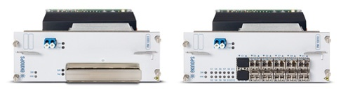

# DWDM

**Спектральное уплотнение каналов** \(англ. _Wavelength-division multiplexing, **WDM**_, буквально _мультиплексирование с разделением по длине волны_\) — технология, позволяющая одновременно передавать несколько информационных каналов \(**лямбд**\) по одному оптическому волокну на разных несущих частотах. Термин - **лямбда -** возник в связи с традиционным для физики обозначением длины волны **λ.**

Технология WDM позволяет существенно увеличить пропускную способность канала \(до 20 Тбит/с. В Bell Labs в экспериментах достигли значения 100 петабит\), причем она позволяет использовать уже проложенные волоконно-оптические линии. Благодаря WDM удается организовать двустороннюю многоканальную передачу трафика по одному волокну. Преимуществом DWDM-систем является возможность передачи высокоскоростного сигнала на сверхдальние расстояния без использования промежуточных пунктов \(без регенерации сигнала и промежуточных усилителей\)[\[3\]](http://ru.wikipedia.org/wiki/DWDM#cite_note-3). Эти преимущества крайне востребованы для передачи данных через малонаселенные земли.

Оборудование DWDM не занимается непосредственно проблемами передачи данных на каждой волне, то есть способом кодирования информации и протоколом ее передачи. Его основными функциями являются операции мультиплексирования и демультиплексирования, а именно — объединение различных волн в одном световом пучке и выделение информации каждого спектрального канала из общего сигнала.

Современные WDM-системы на основе стандартного частотного плана \(ITU-T Rec. G.692\) можно подразделить на три группы:

* грубые WDM \(Coarse WDM — CWDM\) — системы с частотным разносом каналов не менее 200 ГГц, позволяющие мультиплексировать не более 18 каналов.

\(Используемые в настоящее время CWDM работают в полосе от 1270 нм до 1610 нм, промежуток между каналами 20 нм \(200Ghz\), можно мультиплексировать 16 спектральных каналов.\)

* плотные WDM \(Dense WDM — **DWDM**\) — системы с разносом каналов не менее 100 ГГц, позволяющие мультиплексировать не более 40 каналов - **400 гигабит.**
* высокоплотные WDM \(High Dense WDM — HDWDM\) — системы с разносом каналов 50 ГГц и менее, позволяющие мультиплексировать не менее 64 каналов.

Частотный план для CWDM-систем определяется стандартом ITU G.694.2. Область применения технологии CWDM — городские сети с расстоянием до 50 км. Достоинством этого вида WDM систем является низкая \(по сравнению с остальными типами\) стоимость оборудования вследствие меньших требований к компонентам.

Частотный план для DWDM-систем определяется стандартом ITU G.694.1. Область применения — магистральные сети. Этот вид WDM-систем предъявляет более высокие требования к компонентам, чем CWDM \(ширина спектра источника излучения, температурная стабилизация источника и т. д.\). Толчок к бурному развитию DWDM сетей дало появление недорогих и эффективных волоконных эрбиевых усилителей \(**EDFA**\), работающих в промежутке от 1525 до 1565 нм \(третье окно прозрачности кварцевого волокна\).

**EDFA** \(англ. _Erbium Doped Fibre Amplifier_\) — волоконно-оптический усилитель на оптическом волокне, легированном ионами эрбия. Применяется в волоконно-оптических линиях передачи для восстановления уровня оптического сигнала. Преимуществом эрбиевых усилителей является отсутствие преобразования в электрический сигнал, возможность одновременного усиления сигналов с разными длинами волн \(что обуславливает возможность усиления спектрально-мультиплексированного сигнала\), практически точное соответствие рабочего диапазона эрбиевых усилителей области минимальных оптических потерь световодов на основе кварцевого стекла, сравнительно низкий уровень шума и простота включения в волоконно-оптическую систему.

### Описание оборудования 

#### Шасси 

Оборудование представляет из себя шасси Ekinops C200 с установленными модулями:

Шасси имеет размер 2RUx19"x300mm и устанавливается в стойку с магистральным маршрутизатором Juniper MX960 или как можно ближе к нему. В городах регенерации допускается установка в других местах, при условии что все шасси будут находиться в одной стойке.

Шасси имеет два независимых блока питания 48V. Номинальное потребление электроэнергии - 160W, максимальное - 200W.

Управление подключается в коммутатор CSW в любой свободный порт и подписывается соответствующим образом. VLAN управления пробрасывается до BGW города, где и терминируется сеть управления.

#### Платы 

Линейная и клиентская часть расположены на одной плате транспондера \(100G Line/100G CFP Client\), либо мукспондера \(100G Line/10\*10GE Client\), установленной в шасси.

Линейная часть представляет из себя транспондер 100G с когерентным приёмом и методом коррекции ошибок SD-FEC. Линейный порт подключается непосредственно в кросс последней мили оператора арендодателя лямбд.

Клиентская часть представлена десятью портами под модули SFP+. Клиентские порты в **городах терминации** подключаются непосредственно в порты маршрутизатора MX960, а в **городах регенерации** коммутируются в такие же \(по порядковому номеру\) порты соседнего шасси Ekinops, а так же частично в коммутаторы bsw, в случае необходимости терминации в городе каналов 10GE.

