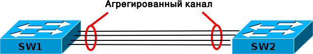

# LACP & агрегация каналов

### LACP

**Link Aggregation Control Protocol \(LACP\)** — протокол, предназначенный для объединения нескольких физических каналов в один логический в сетях Ethernet. Протокол работает на L2 уровне. Агрегированные каналы LACP используются как для повышения пропускной способности, так и повышения отказоустойчивости. Использование LACP в некоторых случаях позволяет обнаружить повреждённый канал, который бы при использовании обычной статической агрегации обнаружен бы не был. Описывается стандартом **IEEE 802.3ad**. Стандарт для всех поставщиков обородувания.

**PAgP \(Port Aggregation Protocol\)**-- собственный протокол агрегации Cisco. Невозможно объединить каналы между коммутатором Cisco и коммутатором другого производителя без использования LACP.

 LACP группирует интерфейсы с одинаковыми:

* скоростью \(speed\)
* режимом дуплекса \(duplex mode\),
* native VLAN,
* диапазон разрешенных VLAN, 
* trunking status, 
* типом интерфейса. 

LACP поддерживает четыре рабочих режима:

1. **On**. Агрегирование каналов производится принудительно без согласования LACP. Другими словами, коммутатор не выполняетотправку пакетов LACP и не обрабатывает входящие пакеты LACP. Аналогично состоянию On для PAgP.
2. **Off**. Агрегирование каналов не выполняется. Пакет LACP не отправляется и не рассматривается. Аналогично состоянию Off дляPAgP.
3. **Passive**. Коммутатор не инициирует создание логического канала, но рассматривает входящие пакеты LACP. Соседний узел \(всостоянии active\) инициирует согласование \(передачей пакета LACP\), которое коммутатор получает и на который отвечает, в конце концов формируя агрегированный канал с соседним узлом. Аналогично режиму auto в PAgP.
4. **Active**. Необходимо сформировать агрегированную линию связи и инициировать согласование. Объединение линий связиформируется, если другая сторона работает в режимах LACP active или passive. Аналогично режиму desirable в PAgP.

### **Общая информация об агрегировании каналов** 

**Агрегация или агрегирование \(лат. aggregatio — присоединение\)** — процесс объединения элементов в одну систему.

**Агрегирование каналов \(агрегация каналов, англ. link aggregation\)** — технология, которая позволяет объединить несколько физических каналов в один логический. Такое объединение позволяет увеличивать пропускную способность и надежность канала. Агрегирование каналов может быть настроено между двумя коммутаторами, коммутатором и маршрутизатором, между коммутатором и хостом.

Агрегирование каналов позволяет решить две задачи:

* повысить пропускную способность канала
* обеспечить резерв на случай выхода из строя одного из каналов 

Большинство технологий по агрегированию позволяют объединять только параллельные каналы. То есть такие, которые начинаются на одном и том же устройстве и заканчиваются на другом.

  
Если рассматривать избыточные соединения между коммутаторами, то без использования специальных технологий для агрегирования каналов, передаваться данные будут только через один интерфейс, который не заблокирован STP. Такой вариант позволяет обеспечить резервирование каналов, но не дает возможности увеличить пропускную способность.

  
\*\*\*Без использования STP такое избыточное соединение создаст петлю в сети.

Технологии по агрегированию каналов позволяют использовать все интерфейсы одновременно. При этом устройства контролируют распространение широковещательных фреймов \(а также multicast и unknown unicast\), чтобы они не зацикливались. Для этого коммутатор, при получении широковещательного фрейма через обычный интерфейс, отправляет его в агрегированный канал только через один интерфейс. А при получении широковещательного фрейма из агрегированного канала, не отправляет его назад.

### **Балансировка**

Хотя агрегирование каналов позволяет увеличить пропускную способность канала, не стоит рассчитывать на идеальную балансировку нагрузки между интерфейсами в агрегированном канале. Технологии по балансировке нагрузки в агрегированных каналах, как правило, ориентированы на балансировку по таким критериям: MAC-адресам, IP-адресам, портам отправители или получателя \(по одному критерию или их комбинации\). То есть, реальная загруженность конкретного интерфейса никак не учитывается. Поэтому один интерфейс может быть загружен больше, чем другие. Более того, при неправильном выборе метода балансировки \(или если недоступны другие методы\) или в некоторых топологиях, может сложиться ситуация, когда реально все данные будут передаваться, например, через один интерфейс.

### **Распределенное агрегирование \(Distributed Trunking\)**

Некоторые разработки позволяют агрегировать каналы, которые соединяют разные устройства. Таким образом резервируется не только канал, но и само устройство. Такие технологии в общем, как правило, называются распределенным агрегированием каналов.

