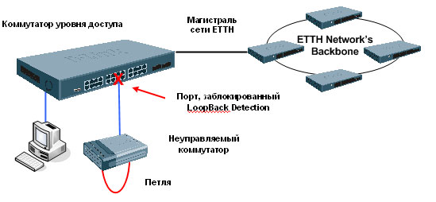

# LoopBack Detection \(LBD\)

Одной из основных проблем сети ethernet являются, так называемые, петли. Они возникают когда \(в основном из-за человеческого фактора\) в топологии сети образуется кольцо. К примеру, два порта коммутатора соединили патч-кордом \(часто бывает когда два свича заменяют на один и не глядя втыкают всё, что было\) или запустили узел по новой линии, а старую отключить забыли \(последствия могут быт печальными и трудно выявляемыми\). В результате такой петли пакеты начинают множиться, сбиваются таблицы коммутации и начинается лавинообразный рост трафика. В таких условиях возможны зависания сетевого оборудования и полное нарушение работы сети.  
  
Помимо настоящих петель не редки случаи когда при выгорания порта \(коммутатора или сетевой карты\) он начинает возвращать полученные пакеты назад в сеть, при этом чаще всего соединение согласовывается в 10M, а линк поднимается даже при отключенном кабеле. Когда в сегменте такой порт только один, последствия могут быть не столь плачевными, но всё же весьма чувствительны \(особенно сильно страдают пользователи висты и семёрки\). В любом случае с такими вещами нужно нещадно бороться и понимать тот факт, что намеренно или случайно создавая петлю, пусть и на небольшой период времени, можно отключить целый сегмент сети.  
  
К счастью большинство современных управляемых коммутаторов, в том или ином виде, имеют функции выявления петель \(loopdetect, stp\), и даже более того, семейство протоколов stp позволяет специально строить кольцевую топологию \(для повышения отказоустойчивости и надёжности\). Но тут есть и обратная сторона медали, не редко случается так, что один сгоревший порт может оставить без связи целый район. Или скажем у того же stp перестроение топологии происходит далеко не мгновенно, связь в этот момент, естественно, оставляет желать лучшего. Кроме того, некоторые производители весьма халатно относятся к реализации протоколов обнаружения петель, скажем DES-3016 \(D-link\) вообще не может определить петлю если просто соединить два его порта.

Рассмотрим ситуацию показанную на рисунке. Коммутатор с петлей является источником бесконечных BroadCast-пакетов, серьезно перегружающих сеть.

Чтобы избежать такой ситуации, используется функция Loopback Detection, которая позволяет временно отключить порт коммутатора, если на нем обнаружена петля. Петля на порту обнаруживается путём отсылки коммутатором пакета CTP \(Configuration Testing Protocol\) с адресом назначения CF-00-00-00-00-00, это нужно учитывать при составлении правил ACL. Когда коммутатор обнаружит получение CTP-пакетов, отправленных с его порта или VLAN, то это означает образование петли в сети. При этом коммутатор автоматически заблокирует данный порт или VLAN и отправит предупреждение администратору.

Функция Loopback Detection может использоваться на определенном диапазоне портов. 

### Команды для настройки коммутатора

enable loopdetect  
config loopdetect ports 1-24 state enabled  
config loopdetect recover\_timer 60 interval 10 mode port-based \(recover\_timer – время, в течение которого порты будут отключены. Interval – интервалы между отправкой пакетов обнаружения петли. Время для этих параметров задаётся глобально на коммутаторе.\).

Mode port-based – Режим обнаружения петли на порту коммутатора. При обнаружении петли блокируется порт.  
Mode vlan-based – Режим обнаружения петли в VLAN. Используется в случаях, когда на одном порту присутствует несколько VLAN. При обнаружении петли блокируется трафик из конкретного VLAN.

