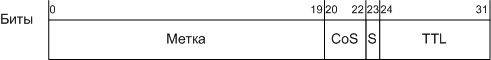
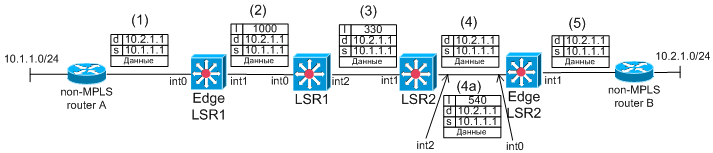
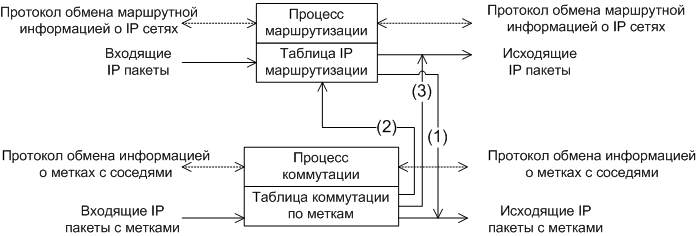

# MPLS. Основные понятия. Принцип работы

### Определение MPLS

**MPLS** \(англ. multiprotocol label switching — многопротокольная коммутация по меткам\) — механизм в высокопроизводительной телекоммуникационной сети, осуществляющий передачу данных от одного узла сети к другому с помощью меток.  
MPLS является масштабируемым и независимым от каких-либо протоколов механизмом передачи данных. В сети, основанной на MPLS, пакетам данных присваиваются метки. Решение о дальнейшей передаче пакета данных другому узлу сети осуществляется только на основании значения присвоенной метки без необходимости изучения самого пакета данных. За счет этого возможно создание сквозного виртуального канала, независимого от среды передачи и использующего любой протокол передачи данных.  
Архитектура MPLS регламентируется в документе IETF "Multiprotocol Label Switching Architecture" \(RFC3031\).

### Основные понятия

В традиционных сетях IP, в общем случае, маршрутизация пакетов осуществляется на основе IP адреса назначения \(destination IP address\). Каждый маршрутизатор в сети обладает информацией о том, через какой интерфейс и какому соседу необходимо перенаправить пришедший IP-пакет.  
 Мультипротокольная коммутация по меткам предлагает несколько другой подход. Каждому IP-пакету назначается некая метка. Маршрутизаторы принимают решение о передаче пакета следующему устройству на основании значения метки. Метка добавляется в составе MPLS заголовка, который добавляется между заголовком кадра \(второй уровень OSI\) и заголовком пакета \(третий уровень модели OSI\). Пример на рис.1.

Рис. 1. Место MPLS заголовка в кадре.

Формат MPLS заголовка представлен на рис. 2.

Рис. 2. Формат MPLS-метки.

Описание полей MPLS-заголовка:

* Метка - собственно метка по которой и осуществляется коммутация;
* CoS - поле описывающее класс обслуживания пакета \(аналог IP precedence\);
* TTL - time-to-live - аналог IP TTL;
* S - Одному пакету может быть назначено несколько меток \("стек" меток\). S - поле-флаг обозначающий то что метка последняя в "стеке". Пример изображён на рис. 3.

Рис. 3. Пример назначения стека меток.

У последней метки в стеке значение поля "S" равно 1 \(на рисунке это метка MPLS N1\). У остальных меток \(метка MPLS N2 и N3\) значение поля "S" равно 0. Стек меток используется для реализации дополнительных возможностей сети на базе MPLS, например MPLS/VPN или MPLS/TrafficEnenirring.  
В рамках архитектуры MPLS различают следующие типы устройств:

* LSR - Label-Switch Router - маршрутизатор, поддерживающий коммутацию по меткам и традиционную IP-маршрутизацию.
* Edge LSR - маршрутизатор, подключённый к устройствам, не осуществляющим коммутацию по меткам \(устройства могут используют другую политику маршрутизации или вообще не поддерживают MPLS\).
* MPLS domain - MPLS-домен - группа соединённых устройств осуществляющих коммутацию по меткам, находящихся под единым административным подчинением и функционирующих в соответствии с единой политикой маршрутизации. MPLS домен образуется LSR-ами, а на границе домена размещаются устройства E-LSR.

### Процесс коммутации по меткам \(label switching\)

Рассмотрим схему, приведённую на рис. 4. MPLS-домен образован двумя LSR-ами и двумя E-LSR-ами. К домену подключены два маршрутизатора использующие традиционную IP-маршрутизацию.

Рис. 4. Пример прохождения пакета через MPLS-домен.

Рассмотрим путь следования IP-пакета от маршрутизатора А к маршрутизатору В через MPLS домен. Адресом источника IP-пакета является 10.1.1.1 \(на рисунке обозначено "s"\). Адресом назначения IP-пакета является 10.2.1.1 \(на рисунке обозначено "d"\). Заголовки кадров не приведены. Таблицы IP-маршрутизации и MPLS-коммутации приведены в табл. 1-5. В таблицах приведены только используемые в примере записи.

Табл. 1. Edge LSR1 \(IP маршрутизация\)

| подсеть | выходной интерфейс | метка |
| :--- | :--- | :--- |
| 10.2.1.0/24 | int1 | 1000 |

Табл. 2. LSR1 \(коммутация по меткам\)

| входной интерфейс | метка | выходной интерфейс | метка |
| :--- | :--- | :--- | :--- |
| int0 | 1000 | int2 | 330 |

Табл. 3. LSR2 \(коммутация по меткам\)

| входной  интерфейс | метка | выходной интерфейс | метка |
| :--- | :--- | :--- | :--- |
| int1 | 330 | int2 | pop/540 |

Табл. 4. Edge LSR2 \(коммутация по меткам\)

| входной интерфейс  |  метка | выходной интерфейс | метка |
| :--- | :--- | :--- | :--- |
| int0 | 540 | необходим анализ таблици IP маршрутизации |  |

Табл. 5. Edge LSR2 \(IP маршрутизация\)

| подсеть | выходной интерфейс | метка |
| :--- | :--- | :--- |
| 10.2.1.0/24 | int1 | нет |

**Этап 1** - маршрутизатор А пересылает обыкновенный IP-пакет в сторону E-LSR.

**Этап 2** - E-LSR получает IP-пакет и на основе таблиц IP-маршрутизации \(табл. N1\) определяет, что данному пакету должна быть назначена метка 1000 \(на рисунке обозначено "l"\) и пакет должен быть переслан в сторону LSR1. Данный процесс называется "назначение метки" \(label imposing\).

_Примечание: Образование таблиц MPLS-коммутации рассмотрено далее._

**Этап 3** - LSR1 получает IP-пакет с меткой 1000 и на основе таблицы MPLS-коммутации \(табл. N2\) определяет, что метка пакета должна быть сменена на 330 и пакет должен быть переслан в сторону LSR2. Данный процесс называется переписывание метки \(label swapping\).

**Этап 4** - LSR2 получает IP-пакет с меткой 330 и на основе таблицы MPLS-коммутации \(табл. N3\) определяет, что пакет должен быть переслан в сторону LSR2 без меток \(значение pop\). Возможен так же вариант, когда LSR2 пересылает пакет в сторону E-LSR с меткой \(в нашем случае 540\). Если пакет следует по этапу N4 то такое поведение называется Penultimate Hop Popping. Поведение LSR в соответствии с этапом N4а является классическим для MPLS.

**Этап 5** - E-LSR получает IP-пакте \(как с меткой, так и без\) и на основании таблиц IP-маршрутизации \(табл. N5\) или MPLS-коммутации \(табл. N6\) определяет, что данный пакет должен быть переслан, как обыкновенный IP-пакет \(без метки\) в сторону маршрутизатора В. Если пакет был получен без метки \(Penultimate Hop Popping\), то E-LSR должен выполнять только анализ таблицы IP-маршрутизации. Если пакет получен с меткой, то маршрутизатор должен сначала проанализировать таблицу MPLS-коммутации, на основании её определить, что для данного пакета необходимо выполнить анализ таблицы IP-маршрутизации. И только после анализа таблицы IP-маршрутизации определяется тот сосед, которому должен быть переслан пакет. Именно для исключения промежуточного анализа таблицы MPLS-коммутации на E-LSR-е применяется Penultimate Hop Popping.

### **Label Switch Path**

В примере, приведённом выше, IP-пакет проследовал через "маршрут коммутации по меткам" - Label Switch Path \(LSP\). LSP - это последовательность устройств в MPLS домене, через которые проследовал пакет с меткой при фиксированном размере стека меток. Принципиально важно в определении LSP, то что, на всем пути размер стека не меняется. То есть, если где-то на пути следования пакета к одной метке добавляется другая \(в стеке получается две метки\), то LSR-ы коммутирующие по второй \(внешней метке\) из LSP исключаются. Подробно такие случаи будут рассмотрены далее. Для нашего примера LSP это последовательность: E-LSR, LSR1, LSR2, E-LSR. При использовании PHP, строго говоря, второй E-LSR не должен быть включён в LSP, так как при пересылке ему стек меток был пуст. Но для PHP допускается исключение.

_Примечание: Иногда LSP описывают последовательностью меток и выходных интерфейсов, в этом случае LSP из примера: 1000\(int1\), 330\(int2\), 540\(int2\) или LSP: 1000\(int1\), 330\(int2\), null\(int2\)  - в случае использования PHP._

На LSR для каждой "входящей" метки на основе таблицы MPLS-коммутации однозначно определяется "выходящая" метка и интерфейс, через который пакет должен быть переслан. Поэтому, первая метка, устанавливаемая E-LSR-ом, однозначно определяет весь маршрут следования пакета через MPLS домен. Этот маршрут и называется LSP.

### **Forwarding Equivalence Classes**

 E-LSR каждому LSP в соответствие устанавливает некоторое множество подсетей. Пакеты, предназначенные этим подсетям, передаются E-LSR-ом по одному LSP. В примере, описанном выше, подсети 10.2.1.0/24 соответствует LSP: E-LSR, LSR1, LSR2, E-LSR. Таким образом, уже на E-LSR становиться однозначно понятно по какому маршруту будет коммутироваться пакет. Множество подсетей, поставленное в соответствии конкретному LSP, называется Forwarding Equivalence Classes \(FEC\).

### **Архитектура E-LSR/LSR**

 LSR выполняет два процесса: маршрутизации и коммутации по меткам. Процесс маршрутизации функционирует на базе внутреннего протокола маршрутизации \(например, OSPF\). Процесс маршрутизации получает маршрутную информацию от соседей и формирует таблицу маршрутизации. Таблица маршрутизации используется для маршрутизации обыкновенных IP-пакетов.

 Процесс коммутации функционирует на базе протокола обмена метками между соседями \(Label Distribution Protocol\). Протокол обмена метками согласует конкретные значения меток для создания целостных маршрутов коммутации по меткам \(LSP\). Подробно функционирование данного протокола рассмотрено в отдельной статье. Процесс коммутации по меткам при составлении таблиц коммутации использует так же таблицу IP-маршрутизации. Взаимосвязь процессов коммутации по меткам и IP-маршрутизации приведена на рис. 5. Описание основных функций выполняемых E-LSR/LSR-ами приведено в табл. 5.

Рис. 5. Взаимосвязь процессов MPLS-коммутации и IP-маршрутизации на LSR/E-LSR.

Табл. 5. Основные функции выполняемые E-LSR/LSR-ами.

<table>
  <thead>
    <tr>
      <th style="text-align:left">&#x424;&#x443;&#x43D;&#x43A;&#x446;&#x438;&#x44F;</th>
      <th style="text-align:left">&#x410;&#x43D;&#x433;&#x43B;&#x43E;&#x44F;&#x437;&#x44B;&#x447;&#x43D;&#x43E;&#x435;
        &#x43D;&#x430;&#x437;&#x432;&#x430;&#x43D;&#x438;&#x435;</th>
      <th style="text-align:left">&#x41E;&#x43F;&#x438;&#x441;&#x430;&#x43D;&#x438;&#x435;</th>
    </tr>
  </thead>
  <tbody>
    <tr>
      <td style="text-align:left">&#x422;&#x440;&#x430;&#x434;&#x438;&#x446;&#x438;&#x43E;&#x43D;&#x43D;&#x430;&#x44F;
        &#x43C;&#x430;&#x440;&#x448;&#x440;&#x443;&#x442;&#x438;&#x437;&#x430;&#x446;&#x438;&#x44F;
        IP-&#x43F;&#x430;&#x43A;&#x435;&#x442;&#x43E;&#x432;</td>
      <td style="text-align:left">IP routing</td>
      <td style="text-align:left">&#x412;&#x445;&#x43E;&#x434;&#x44F;&#x449;&#x438;&#x435; IP-&#x43F;&#x430;&#x43A;&#x435;&#x442;&#x44B;
        &#x43C;&#x430;&#x440;&#x448;&#x440;&#x443;&#x442;&#x438;&#x437;&#x438;&#x440;&#x443;&#x44E;&#x442;&#x441;&#x44F;
        &#x43D;&#x430; &#x43E;&#x441;&#x43D;&#x43E;&#x432;&#x435; &#x442;&#x430;&#x431;&#x43B;&#x438;&#x446;&#x44B;
        &#x43C;&#x430;&#x440;&#x448;&#x440;&#x443;&#x442;&#x438;&#x437;&#x430;&#x446;&#x438;&#x438;.</td>
    </tr>
    <tr>
      <td style="text-align:left">&#x41D;&#x430;&#x437;&#x43D;&#x430;&#x447;&#x435;&#x43D;&#x438;&#x435;
        &#x43C;&#x435;&#x442;&#x43A;&#x438;</td>
      <td style="text-align:left">label imposing</td>
      <td style="text-align:left">&#x441;&#x43B;&#x438; &#x443;&#x441;&#x442;&#x440;&#x43E;&#x439;&#x441;&#x442;&#x432;&#x43E;
        &#x444;&#x443;&#x43D;&#x43A;&#x446;&#x438;&#x43E;&#x43D;&#x438;&#x440;&#x443;&#x435;&#x442;
        &#x432; &#x43A;&#x430;&#x447;&#x435;&#x441;&#x442;&#x432;&#x435; E-LSR,
        &#x442;&#x43E; &#x434;&#x43B;&#x44F; &#x432;&#x445;&#x43E;&#x434;&#x44F;&#x449;&#x435;&#x433;&#x43E;
        IP-&#x43F;&#x430;&#x43A;&#x435;&#x442;&#x430; &#x43D;&#x430; &#x431;&#x430;&#x437;&#x435;
        &#x442;&#x430;&#x431;&#x43B;&#x438;&#x446;&#x44B; IP-&#x43C;&#x430;&#x440;&#x448;&#x440;&#x443;&#x442;&#x438;&#x437;&#x430;&#x446;&#x438;&#x438;
        &#x43E;&#x43F;&#x440;&#x435;&#x434;&#x435;&#x43B;&#x44F;&#x435;&#x442;&#x441;&#x44F;
        &#x43C;&#x435;&#x442;&#x43A;&#x430;, &#x43A;&#x43E;&#x442;&#x43E;&#x440;&#x430;&#x44F;
        &#x434;&#x43E;&#x43B;&#x436;&#x43D;&#x430; &#x431;&#x44B;&#x442;&#x44C;
        &#x43D;&#x430;&#x437;&#x43D;&#x430;&#x447;&#x435;&#x43D;&#x430;, &#x438;
        &#x432;&#x44B;&#x445;&#x43E;&#x434;&#x43D;&#x43E;&#x439; &#x438;&#x43D;&#x442;&#x435;&#x440;&#x444;&#x435;&#x439;&#x441;,
        &#x447;&#x435;&#x440;&#x435;&#x437; &#x43A;&#x43E;&#x442;&#x43E;&#x440;&#x44B;&#x439;
        &#x434;&#x43E;&#x43B;&#x436;&#x435;&#x43D; &#x431;&#x44B;&#x442;&#x44C;
        &#x43F;&#x435;&#x440;&#x435;&#x441;&#x43B;&#x430;&#x43D; &#x43F;&#x430;&#x43A;&#x435;&#x442;
        (1)</td>
    </tr>
    <tr>
      <td style="text-align:left">&#x41A;&#x43E;&#x43C;&#x43C;&#x443;&#x442;&#x430;&#x446;&#x438;&#x44F;
        &#x43F;&#x43E; &#x43C;&#x435;&#x442;&#x43A;&#x435;</td>
      <td style="text-align:left">label swapping</td>
      <td style="text-align:left">
        
&#x412;&#x445;&#x43E;&#x434;&#x44F;&#x449;&#x438;&#x435; IP-&#x43F;&#x430;&#x43A;&#x435;&#x442;&#x44B;
          &#x441; &#x43C;&#x435;&#x442;&#x43A;&#x430;&#x43C;&#x438; &#x43E;&#x431;&#x440;&#x430;&#x431;&#x430;&#x442;&#x44B;&#x432;&#x430;&#x44E;&#x442;&#x441;&#x44F;
          &#x43F;&#x440;&#x43E;&#x446;&#x435;&#x441;&#x441;&#x43E;&#x43C; &#x43A;&#x43E;&#x43C;&#x43C;&#x443;&#x442;&#x430;&#x446;&#x438;&#x438;
          &#x43F;&#x43E; &#x43C;&#x435;&#x442;&#x43A;&#x430;&#x43C;, &#x43A;&#x43E;&#x442;&#x43E;&#x440;&#x44B;&#x439;
          &#x43D;&#x430; &#x43E;&#x441;&#x43D;&#x43E;&#x432;&#x430;&#x43D;&#x438;&#x438;
          &#x442;&#x430;&#x431;&#x43B;&#x438;&#x446;&#x44B; &#x43A;&#x43E;&#x43C;&#x43C;&#x443;&#x442;&#x430;&#x446;&#x438;&#x438;
          &#x43F;&#x43E; &#x43C;&#x435;&#x442;&#x43A;&#x430;&#x43C; &#x43E;&#x43F;&#x440;&#x435;&#x434;&#x435;&#x43B;&#x44F;&#x435;&#x442;,
          &#x43A;&#x430;&#x43A;&#x43E;&#x435; &#x438;&#x437; &#x441;&#x43B;&#x435;&#x434;&#x443;&#x44E;&#x449;&#x438;&#x445;
          &#x434;&#x435;&#x439;&#x441;&#x442;&#x432;&#x438;&#x439; &#x431;&#x443;&#x434;&#x435;&#x442;
          &#x432;&#x44B;&#x43F;&#x43E;&#x43B;&#x43D;&#x435;&#x43D;&#x43E;:

        <ul>
          <li>&#x41F;&#x435;&#x440;&#x435;&#x441;&#x44B;&#x43B;&#x43A;&#x430; &#x43F;&#x430;&#x43A;&#x435;&#x442;&#x430;
            &#x441;&#x43E; &#x441;&#x43C;&#x435;&#x43D;&#x43E;&#x439; &#x43C;&#x435;&#x442;&#x43A;&#x438;
            &#x447;&#x435;&#x440;&#x435;&#x437; &#x43E;&#x43F;&#x440;&#x435;&#x434;&#x435;&#x43B;&#x451;&#x43D;&#x43D;&#x44B;&#x439;
            &#x438;&#x43D;&#x442;&#x435;&#x440;&#x444;&#x435;&#x439;&#x441; (label
            swapping). &#x41F;&#x440;&#x438; &#x44D;&#x442;&#x43E;&#x439; &#x43E;&#x43F;&#x435;&#x440;&#x430;&#x446;&#x438;&#x438;
            &#x432;&#x43E;&#x437;&#x43C;&#x43E;&#x436;&#x43D;&#x43E; &#x43D;&#x430;&#x437;&#x43D;&#x430;&#x447;&#x435;&#x43D;&#x438;&#x435;
            &#x434;&#x43E;&#x43F;&#x43E;&#x43B;&#x43D;&#x438;&#x442;&#x435;&#x43B;&#x44C;&#x43D;&#x44B;&#x445;
            &#x43C;&#x435;&#x442;&#x43E;&#x43A; &#x432; &quot;&#x441;&#x442;&#x435;&#x43A;&quot;.</li>
          <li>&#x421;&#x43D;&#x44F;&#x442;&#x438;&#x435; &#x43C;&#x435;&#x442;&#x43A;&#x438;
            &#x438; &#x43E;&#x434;&#x43D;&#x43E; &#x438;&#x437; &#x441;&#x43B;&#x435;&#x434;&#x443;&#x44E;&#x449;&#x438;&#x445;
            &#x434;&#x435;&#x439;&#x441;&#x442;&#x432;&#x438;&#x439;.
            <ul>
              <li>&#x435;&#x441;&#x43B;&#x438; &#x43C;&#x435;&#x442;&#x43A;&#x430; &#x431;&#x44B;&#x43B;&#x430;
                &#x43F;&#x43E;&#x441;&#x43B;&#x435;&#x434;&#x43D;&#x44F;&#x44F; &#x432;
                &#x441;&#x442;&#x435;&#x43A;&#x435;, &#x442;&#x43E; &#x43F;&#x430;&#x43A;&#x435;&#x442;
                &#x43F;&#x435;&#x440;&#x435;&#x434;&#x430;&#x451;&#x442;&#x441;&#x44F;
                &#x43F;&#x440;&#x43E;&#x446;&#x435;&#x441;&#x441;&#x443; &#x43C;&#x430;&#x440;&#x448;&#x440;&#x443;&#x442;&#x438;&#x437;&#x430;&#x446;&#x438;&#x438;
                IP-&#x43F;&#x430;&#x43A;&#x435;&#x442;&#x43E;&#x432; (2) (&#x442;&#x440;&#x430;&#x434;&#x438;&#x446;&#x438;&#x43E;&#x43D;&#x43D;&#x430;&#x44F;
                &#x43A;&#x43E;&#x43C;&#x43C;&#x443;&#x442;&#x430;&#x446;&#x438;&#x44F;)
                &#x438;&#x43B;&#x438; &#x43F;&#x435;&#x440;&#x435;&#x441;&#x44B;&#x43B;&#x430;&#x435;&#x442;&#x441;&#x44F;
                &#x447;&#x435;&#x440;&#x435;&#x437; &#x43E;&#x43F;&#x440;&#x435;&#x434;&#x435;&#x43B;&#x451;&#x43D;&#x43D;&#x44B;&#x439;
                &#x438;&#x43D;&#x442;&#x435;&#x440;&#x444;&#x435;&#x439;&#x441; (&#x43A;&#x43E;&#x43C;&#x43C;&#x443;&#x442;&#x430;&#x446;&#x438;&#x438;
                &#x441; PHP) (3).</li>
              <li>&#x435;&#x441;&#x43B;&#x438; &#x43C;&#x435;&#x442;&#x43A;&#x430; &#x431;&#x44B;&#x43B;&#x430;
                &#x43D;&#x435; &#x43F;&#x43E;&#x441;&#x43B;&#x435;&#x434;&#x43D;&#x44F;&#x44F;
                &#x432; &#x441;&#x442;&#x435;&#x43A;&#x435;, &#x442;&#x43E; &#x43F;&#x430;&#x43A;&#x435;&#x442;
                &#x43F;&#x435;&#x440;&#x435;&#x441;&#x44B;&#x43B;&#x430;&#x435;&#x442;&#x441;&#x44F;
                &#x447;&#x435;&#x440;&#x435;&#x437; &#x43E;&#x43F;&#x440;&#x435;&#x434;&#x435;&#x43B;&#x451;&#x43D;&#x43D;&#x44B;&#x439;
                &#x438;&#x43D;&#x442;&#x435;&#x440;&#x444;&#x435;&#x439;&#x441;.</li>
            </ul>
          </li>
        </ul>
        
<em>&#x41F;&#x440;&#x438;&#x43C;&#x435;&#x447;&#x430;&#x43D;&#x438;&#x435;: &#x432;&#x44B;&#x445;&#x43E;&#x434;&#x43D;&#x43E;&#x439; &#x438;&#x43D;&#x442;&#x435;&#x440;&#x444;&#x435;&#x439;&#x441; &#x43E;&#x43F;&#x440;&#x435;&#x434;&#x435;&#x43B;&#x44F;&#x435;&#x442;&#x441;&#x44F; &#x43D;&#x430; &#x43E;&#x441;&#x43D;&#x43E;&#x432;&#x435; &#x442;&#x430;&#x431;&#x43B;&#x438;&#x446;&#x44B; &#x43A;&#x43E;&#x43C;&#x43C;&#x443;&#x442;&#x430;&#x446;&#x438;&#x438; &#x43F;&#x43E; &#x43C;&#x435;&#x442;&#x43A;&#x430;&#x43C;.</em>
        

      </td>
    </tr>
    <tr>
      <td style="text-align:left">&#x421;&#x43D;&#x44F;&#x442;&#x438;&#x435; &#x43C;&#x435;&#x442;&#x43A;&#x438;</td>
      <td
      style="text-align:left">label poping</td>
        <td style="text-align:left"></td>
    </tr>
    <tr>
      <td style="text-align:left">&#x421;&#x43D;&#x44F;&#x442;&#x438;&#x435; &#x43C;&#x435;&#x442;&#x43A;&#x438;
        (PHP)</td>
      <td style="text-align:left">label poping with PHP</td>
      <td style="text-align:left"></td>
    </tr>
  </tbody>
</table>### **Примеры таблиц маршрутизации и коммутации.**

 Примеры таблиц IP-маршрутизации и MPLS-коммутации приведены в табл. 6-7.

Табл. 6. Пример таблицы IP-маршрутизации на E-LSR.

| Адрес подсети | Адрес next-hop | Исходящий интерфейс | Метка | Комментарий |
| :--- | :--- | :--- | :--- | :--- |
| 10.1.2.0/24 | 10.1.3.1 | Serial1 | нет | Запись для традиционной IP-маршрутизации |
| 10.1.4.0/24 | 10.1.5.1 | Serial2 | 100 | Записи, в соответствии с которыми, пакету предназначенному для сети 10.1.4.0/24 или 10.3.0.0/16 будет назначена метка 100. Пакет с меткой будет переслан через интерфейс Serial1 \(label imposing\). Заметим, что подсети 10.1.4.0/24 и 10.3.0.0/16 образуют единый FEC. |
| 10.3.0.0/16 | 10.1.5.1 | Serial2 | 100 |  |
| 10.1.6.0/24 | 10.1.7.1 | Serial3 | 300/200 | Запись, в соответствии с которой, пакету предназначенному для сети 10.1.6.0/24 будут назначены две метки 300, 200 в стеке, и пакет с метками будет переслан через интерфейс Serial1 \(label imposing\) |

Табл. 7. Пример таблицы MPLS-коммутации на E-LSR/LSR.

<table>
  <thead>
    <tr>
      <th style="text-align:left">&#x412;&#x445;&#x43E;&#x434;&#x44F;&#x449;&#x438;&#x439; &#x438;&#x43D;&#x442;&#x435;&#x440;&#x444;&#x435;&#x439;&#x441;</th>
      <th
      style="text-align:left">&#x412;&#x445;&#x43E;&#x434;&#x44F;&#x449;&#x430;&#x44F; &#x43C;&#x435;&#x442;&#x43A;&#x430;</th>
        <th
        style="text-align:left">&#x418;&#x441;&#x445;&#x43E;&#x434;&#x44F;&#x449;&#x438;&#x439; &#x438;&#x43D;&#x442;&#x435;&#x440;&#x444;&#x435;&#x439;&#x441;</th>
          <th
          style="text-align:left">&#x418;&#x441;&#x445;&#x43E;&#x434;&#x44F;&#x449;&#x430;&#x44F; &#x43C;&#x435;&#x442;&#x43A;&#x430;</th>
            <th
            style="text-align:left">&#x41A;&#x43E;&#x43C;&#x43C;&#x435;&#x43D;&#x442;&#x430;&#x440;&#x438;&#x439;</th>
    </tr>
  </thead>
  <tbody>
    <tr>
      <td style="text-align:left">Serial1</td>
      <td style="text-align:left">100</td>
      <td style="text-align:left">Serial3</td>
      <td style="text-align:left">200</td>
      <td style="text-align:left">&#x41E;&#x431;&#x44B;&#x43A;&#x43D;&#x43E;&#x432;&#x435;&#x43D;&#x43D;&#x430;&#x44F;
        &#x43A;&#x43E;&#x43C;&#x43C;&#x443;&#x442;&#x430;&#x446;&#x438;&#x44F;
        (label swapping)</td>
    </tr>
    <tr>
      <td style="text-align:left">Ethernet2</td>
      <td style="text-align:left">100</td>
      <td style="text-align:left">Serial2</td>
      <td style="text-align:left">305/200</td>
      <td style="text-align:left">&#x41A;&#x43E;&#x43C;&#x43C;&#x443;&#x442;&#x430;&#x446;&#x438;&#x44F;
        &#x441; &#x434;&#x43E;&#x431;&#x430;&#x432;&#x43B;&#x435;&#x43D;&#x438;&#x435;&#x43C;
        &#x43C;&#x435;&#x442;&#x43E;&#x43A; &#x432; &#x441;&#x442;&#x435;&#x43A;
        (label swapping)</td>
    </tr>
    <tr>
      <td style="text-align:left">Serial2</td>
      <td style="text-align:left">300</td>
      <td style="text-align:left">Serial3</td>
      <td style="text-align:left">pop</td>
      <td style="text-align:left">
        
&#x421;&#x43D;&#x44F;&#x442;&#x438;&#x435; &#x43C;&#x435;&#x442;&#x43A;&#x438;
          &#x438; &#x43F;&#x435;&#x440;&#x435;&#x441;&#x44B;&#x43B;&#x43A;&#x430;
          &#x43F;&#x430;&#x43A;&#x435;&#x442;&#x430; &#x447;&#x435;&#x440;&#x435;&#x437;
          &#x438;&#x43D;&#x442;&#x435;&#x440;&#x444;&#x435;&#x439;&#x441; Serial3.
          &#x414;&#x430;&#x43D;&#x43D;&#x44B;&#x439; &#x432;&#x430;&#x440;&#x438;&#x430;&#x43D;&#x442;
          &#x432;&#x43E;&#x437;&#x43C;&#x43E;&#x436;&#x435;&#x43D; &#x432; &#x434;&#x432;&#x443;&#x445;
          &#x441;&#x43B;&#x443;&#x447;&#x430;&#x44F;&#x445;:
           
        

        <ul>
          <li>&#x441;&#x43D;&#x438;&#x43C;&#x430;&#x435;&#x442;&#x441;&#x44F; &#x43D;&#x435;
            &#x43F;&#x43E;&#x441;&#x43B;&#x435;&#x434;&#x43D;&#x44F;&#x44F; &#x43C;&#x435;&#x442;&#x43A;&#x430;;</li>
          <li>&#x441;&#x43D;&#x438;&#x43C;&#x430;&#x435;&#x442;&#x441;&#x44F; &#x43F;&#x43E;&#x441;&#x43B;&#x435;&#x434;&#x43D;&#x44F;&#x44F;
            &#x43C;&#x435;&#x442;&#x43A;&#x430; &#x438; LSR &#x438;&#x441;&#x43F;&#x43E;&#x43B;&#x44C;&#x437;&#x443;&#x435;&#x442;
            PHP.</li>
        </ul>
      </td>
    </tr>
    <tr>
      <td style="text-align:left">Serial3</td>
      <td style="text-align:left">245</td>
      <td style="text-align:left"></td>
      <td style="text-align:left">pop</td>
      <td style="text-align:left">&#x421;&#x43D;&#x44F;&#x442;&#x438;&#x435; &#x43C;&#x435;&#x442;&#x43A;&#x438;
        &#x438; &#x43F;&#x435;&#x440;&#x435;&#x434;&#x430;&#x447;&#x430; IP-&#x43F;&#x430;&#x43A;&#x435;&#x442;&#x430;
        &#x43F;&#x440;&#x43E;&#x446;&#x435;&#x441;&#x441;&#x443; &#x43C;&#x430;&#x440;&#x448;&#x440;&#x443;&#x442;&#x438;&#x437;&#x430;&#x446;&#x438;&#x438;</td>
    </tr>
  </tbody>
</table>Необходимо отметить, что уникальность меток обеспечиваться только на уровне интерфейса. То есть для двух разных входных интерфейсов могут встречаться одинаковые значения меток \(в таблице коммутации первая и вторая запись\). Таким образом, пакет, пришедший с меткой 100 с интерфейса Serial1 и пакет, пришедший с меткой 100 с интерфейса Ethernet2, проследуют по разным LSP. Уникальной комбинацией является входящий интерфейс и метка. И для этой уникальной комбинации однозначно определяется выходной интерфейс и операция, которая должна быть произведена над меткой. Такой подход позволяет образовывать целостные LSP между E-LSR-ам.

_Примечание: различные производители могут по-разному реализовывать архитектуру LSR/E-LSR. Например, возможно использовать объединённую таблицу IP-маршрутизации и MPLS-коммутации. Или использовать три таблицы: одна только для традиционной IP-маршрутизации, другая для назначения меток, третья для MPLS-коммутации. Приведённая в данном документе архитектура LSR/E-LSR лишь абстрактная модель._

#### Использованные источники: 

1. [http://www.opennet.ru/docs/RUS/mpls/mplsarchitecture.html](http://www.opennet.ru/docs/RUS/mpls/mplsarchitecture.html)
2. [http://ru.wikipedia.org/wiki/MPLS](http://ru.wikipedia.org/wiki/MPLS)
3. ["Multiprotocol Label Switching Architecture" \(RFC3031\)](http://www.ietf.org/rfc/rfc3031.txt)
4. ["MPLS Label Stack Encoding" \(RFC3032\)](http://www.ietf.org/rfc/rfc3032.txt)

