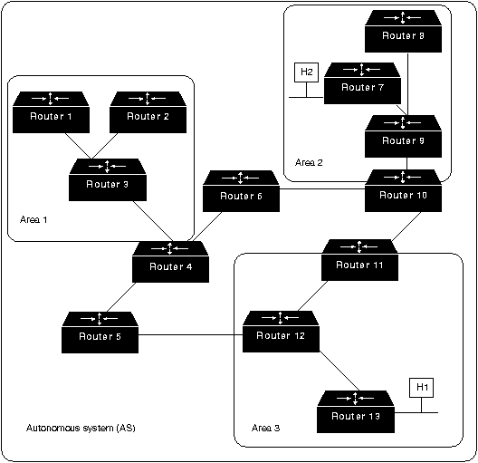

# OSPF

**OSPF** \(англ. Open Shortest Path First\) — протокол динамической маршрутизации, основанный на технологии отслеживания состояния канала \(link-state technology\) и использующий для нахождения кратчайшего пути Алгоритм Дейкстры.

Последняя версия протокола представлена в RFC 2328. Протокол OSPF представляет собой протокол внутреннего шлюза \(Interior Gateway Protocol — IGP\). Протокол OSPF распространяет информацию о доступных маршрутах между маршрутизаторами одной автономной системы.

OSPF имеет следующие преимущества:

* Высокая скорость сходимости по сравнению с дистанционно-векторными протоколами маршрутизации;
* Поддержка сетевых масок переменной длины \(VLSM\);
* Оптимальное использование пропускной способности \(т. к. строится минимальный остовный граф по алгоритму Дейкстры\);

### Алгоритм Дейкстры

На иллюстративном рис. 1 приведена схема узлов \(A-J\) со значениями метрики для каждого из отрезков пути. Анализ графа начинается с узла A \(Старт\). Пути с наименьшим суммарным значением метрики считаются наилучшими. Именно они оказываются выбранными в результате рассмотрения графа \(“кратчайшие пути“\).

Рис. 1 Иллюстрация работы алгоритма Дикстры

Ниже дается формальное описание алгоритма. Сначала вводим некоторые определения.

* Пусть D\(v\) равно сумме весов связей для данного пути.
* Пусть c\(i,j\) равно весу связи между узлами с номерами i и j.

Далее следует последовательность шагов, реализующих алгоритм.

1. Устанавливаем множество узлов N = {1}.
2. Для каждого узла v не из множества n устанавливаем D\(v\)= c\(1,v\).
3. Для каждого шага находим узел w не из множества N, для которого D\(w\) минимально, и добавляем узел w в множество N.
4. Актуализируем D\(v\) для всех узлов не из множества N
5. D\(v\)=min{D\(v\), D\(v\)+c\(w,v\)}.
6. Повторяем шаги 2-4, пока все узлы не окажутся в множестве N.

Более подробное описание работы алгоритма можно прочесть [здесь](http://ru.wikipedia.org/wiki/%C0%EB%E3%EE%F0%E8%F2%EC_%C4%E5%E9%EA%F1%F2%F0%FB).

### Терминология протокола OSPF

* Интерфейс \(interface\) — соединение маршрутизатора и одной из подключенных к нему сетей. При обсуждении OSPF термины интерфейс и канал \(link\) часто употребляются как синонимы.
* Объявление о состоянии канала \(link-state advertisement, LSA\) — объявление описывает все каналы маршрутизатора, все интерфейсы и состояние каналов.
* Состояние канала \(link state\) — состояние канала между двумя маршрутизаторами; обновления происходят при помощи пакетов LSA.
* Метрика \(metric\) — условный показатель «стоимости» пересылки данных по каналу;
* Автономная система \(autonomous system\) — группа маршрутизаторов обменивающихся маршрутной информацией через общий протокол маршрутизации.
* Зона \(area\) — совокупность сетей и маршрутизаторов, имеющих один и тот же идентификатор зоны.
* Соседи \(neighbours\) — два маршрутизатора, имеющие интерфейсы в общей сети.
* Состояние смежности \(adjacency\) — взаимосвязь между определёнными соседними маршрутизаторами установленная с целью обмена информацией маршрутизации.
* Hello-протокол \(hello protocol\) — используется для поддержания соседских отношений.
* База данных соседей \(neighbours database\) — список всех соседей.
* База данных состояния каналов \(link state database, LSDB\) — список всех записей о состоянии каналов. Встречается также термин топологическая база данных \(topological database\), употребляется как синоним базы данных состояния каналов.
* Идентификатор маршрутизатора \(router ID, RID\) — уникальное 32-битовое число, которое уникально идентифицирует маршрутизатор в пределах одной автономной системы.

### Форматы заголовков сообщений OSPF

Все пакеты OSPF начинаются с 24-байтового заголовка, как показано на Рис. 2.

Первое поле в заголовке OSPF - это номер версии OSPF \(version number\). Номер версии обозначает конкретную используемую реализацию OSPF.

 За номером версии идет поле типа \(type\). Существует 5 типов пакета OSPF:

_**Hello.**_ ****Отправляется через регулярные интервалы времени для установления и поддержания соседских взаимоотношений.

_**Database Description.**_ ****Описание базы данных. Описывает содержимое базы данных; обмен этими пакетами производится при инициализации смежности.

_**Link-State Request**_ Запрос о состоянии канала. Запрашивает части топологической базы данных соседа. Обмен этими пакетами производится после того, как какой-нибудь роутер обнаруживает, \(путем проверки пакетов описания базы данных\), что часть его топологической базы данных устарела.

_**Link-State Update**_ Корректировка состояния канала. Отвечает на пакеты запроса о состоянии канала. Эти пакеты также используются для регулярного распределения LSA. В одном пакете могут быть включены несколько LSA.

_**Link-State Acknowledgement**_ Подтверждение состояния канала. Подтверждает пакеты корректировки состояния канала. Пакеты корректировки состояния канала должны быть четко подтверждены, что является гарантией надежности процесса лавинной адресации пакетов корректировки состояния канала через какую-нибудь область.

Каждое LSA в пакете корректировки состояния канала содержит тип поля. Существуют 4 типа LSA:

_Router links advertisements \(RLA\)_ Объявления о каналах роутера. Описывают собранные данные о состоянии каналов роутера, связывающих его с конкретной областью. Любой роутер отправляет RLA для каждой области, к которой он принадлежит. RLA направляются лавинной адресацией через всю область, но они не отправляются за ее пределы.

_Network links advertisements \(NLA\)_ Объявления о сетевых каналах. Отправляются назначенными роутерами. Они описывают все роутеры, которые подключены к сети с множественным доступом, и отправляются лавинной адресацией через область, содержащую данную сеть с множественным доступом.

_Summary links advertisements \(SLA\)_ Суммарные объявления о каналах. Суммирует маршруты к пунктам назначения, находящимся вне какой-либо области, но в пределах данной AS. Они генерируются роутерами границы области, и отправляются лавинной адресацией через данную область. В стержневую область посылаются объявления только о внутриобластных роутерах. В других областях рекламируются как внутриобластные, так и межобластные маршруты.

_AS external links advertisements_ Объявления о внешних каналах AS. Описывают какой-либо маршрут к одному из пунктов назначения, который является внешним для данного AS. Объявления о внешних каналах AS вырабатываются граничными роутерами AS. Этот тип объявлений является единственным типом объявлений, которые продвигаются во всех направлениях данной AS; все другие объявления продвигаются только в пределах конкретных областей.

За полем типа заголовка пакета OSPF идет поле длины пакета \(packet length\). Это поле обеспечивает длину пакета вместе с заголовком OSPF в байтах.

Поле идентификатора роутера \(router ID\) идентифицирует источник пакета.

Поле идентификатора области \(area ID\) идентифицирует область, к которой принадлежит данный пакет. Все пакеты OSPF связаны с одной отдельной областью.

Стандартное поле контрольной суммы IP \(checksum\) проверяет содержимое всего пакета для выявления потенциальных повреждений, имевших место при транзите.

За полем контрольной суммы идет поле типа удостоверения \(authentication type\). Примером типа удостоверения является "простой пароль". Все обмены протокола OSPF проводятся с установлением достоверности. Тип удостоверения устанавливается по принципу "отдельный для каждой области".

За полем типа удостоверения идет поле удостоверения \(authentication\). Это поле длиной 64 бита и содержит информацию удостоверения.

### Иерархия маршрутизации

В отличие от RIP, OSPF может работать в пределах некоторой иерархической системы. Самым крупным объектом в этой иерархии является автономная система \(Autonomous System - AS\) AS является набором сетей, которые находятся под единым управлением и совместно используют общую стратегию маршрутизации. OSPF является протоколом маршрутизации внутри AS, хотя он и способен принимать маршруты из других AS и отправлять маршруты в другие AS.

Любая AS может быть разделена на ряд областей \(area\). Область - это группа смежных сетей и подключенных к ним хостов. Роутеры, имеющие несколько интерфейсов, могут участвовать в нескольких областях. Такие роутеры, которые называются роутерами границы областей \(area border routers\), поддерживают отдельные топологические базы данных для каждой области.

Топологическая база \(topological database\) данных фактически представляет собой общую картину сети по отношению к роутерам. Топологическая база данных содержит набор LSA, полученных от всех роутеров, находящихся в одной области. Т.к. роутеры одной области коллективно пользуются одной и той же информацией, они имеют идентичные топологические базы данных.

Термин "домен" \(domain\) используется для описания части сети, в которой все маршрутизаторы имеют идентичную топологическую базу данных. Термин "домен" часто используется вместо AS.

Топология области является невидимой для объектов, находящихся вне этой области. Путем хранения топологий областей отдельно, OSPF добивается меньшего трафика маршрутизации, чем трафик для случая, когда AS не разделена на области.

Разделение на области приводит к образованию двух различных типов маршрутизации OSPF, которые зависят от того, находятся ли источник и пункт назначения в одной и той же или разных областях. Маршрутизация внутри области имеет место в том случае, когда источник и пункт назначения находятся в одной области; маршрутизация между областями - когда они находятся в разных областях.

Стержневая часть OSPF \(backbone\) отвечает за распределение маршрутной информации между областями. Она включает в себя все роутеры границы области, сети, которые не принадлежат полностью какой-либо из областей, и подключенные к ним роутеры. На Рис. 3 представлен пример объединенной сети с несколькими областями.

На этом рисунке роутеры 4, 5, 6, 10, 11 и 12 образуют стержень. Если хост Н1 Области 3 захочет отправить пакет хосту Н2 Области 2, то пакет отправляется в роутер 13, который продвигает его в роутер 12, который в свою очередь отправляет его в роутер 11. Роутер 11 продвигает пакет вдоль стержня к роутеру 10 границы области, который отправляет пакет через два внутренних роутера этой области \(роутеры 9 и 7\) до тех пор, пока он не будет продвинут к хосту Н2.

Сам стержень представляет собой одну из областей OSPF, поэтому все стержневые роутеры используют те же процедуры и алгоритмы поддержания маршрутной информации в пределах стержневой области, которые используются любым другим роутером. Топология стержневой части невидима для всех внутренних роутеров точно также, как топологии отдельных областей невидимы для стержневой части.

Область может быть определена таким образом, что стержневая часть не будет смежной с ней. В этом случае связность стержневой части должна быть восстановлена через виртуальные соединения. Виртуальные соединения формируются между любыми роутерами стержневой области, которые совместно используют какую-либо связь с любой из нестержневых областей; они функционируют так, как если бы они были непосредственными связями.

Граничные роутеры AS, использующие OSPF, узнают о внешних роутерах через протоколы внешних роутеров \(EGPs\), таких, как Exterior Gateway Protocol \(EGP\) или Border Gateway Protocol \(BGP\), или через информацию о конфигурации

### Выделенный маршрутизатор \(DR\) и резервный выделенный маршрутизатор \(BDR\)

В сетях со множественным доступом отношения соседства устанавливаются между всеми маршрутизаторами. Если бы все маршрутизаторы в состоянии соседства обменивались топологической информацией, это привело бы к рассылке большого количество копий LSA. Если, к примеру, количество маршрутизаторов в сети со множественным доступом равно n, то будет установлено n\(n-1\)/2 отношений соседства. Каждый маршрутизатор будет рассылать n-1 LSA своим соседям, плюс одно LSA для сети, в результате сеть сгенерирует n² LSA.

Для предотвращения проблемы рассылки копий LSA в сетях со множественным доступом выбираются выделенный маршрутизатор \(DR\) и запасной выделенный маршрутизатор \(BDR\).

Выделенный маршрутизатор \(designated router, DR\) — управляет процессом рассылки LSA в сети. Каждый маршрутизатор сети устанавливает отношения смежности с DR. Информация об изменениях в сети отправляется маршрутизатором, обнаружившим это изменение, на выделенный маршрутизатор, а тот, в свою очередь, отвечает за то, чтобы эта информация была отправлена остальным маршрутизаторам сегмента множественного доступа.

Недостатком в схеме работы с DR маршрутизатором является то, что при выходе его из строя должен быть выбран новый DR. Новые отношения соседства должны быть сформированы и, пока базы данных маршрутизаторов не синхронизируются с базой данных нового DR, сеть будет недоступна для пересылки пакетов. Для устранения этого недостатка выбирается BDR.

Резервный выделенный маршрутизатор \(backup designated router, BDR\). Каждый маршрутизатор сети устанавливает отношения соседства не только с DR, но и BDR. DR и BDR также устанавливают отношения соседства и между собой. При выходе из строя DR, BDR становится DR и выполняет все его функции. Так как маршрутизаторы сети установили отношения соседства с BDR, время недоступности сети минимизируется.

Маршрутизатор, выбранный DR или BDR в одной присоединённой к нему сети множественного доступа, может не быть DR \(BDR\) в другой присоединённой сети множественного доступа. Роль DR \(BDR\) является свойством интерфейса, а не свойством всего маршрутизатора. Иными словами, в каждом сегменте множественного доступа \(например, коммутационном сегменте Ethernet\), в котором общаются два или более OSPF-маршрутизатора, процесс выбора и распределение ролей DR/BDR происходит независимо от других сегментов множественного доступа.

**Выбор DR и BDR**

Для того чтобы выбрать для сети DR и BDR, маршрутизаторы просматривают значение приоритета в hello-сообщениях и следуют таким условиям для того чтобы определить какой маршрутизатор выбрать:

*  Маршрутизатор с наивысшим значением приоритета становится DR.
*  Маршрутизатор со вторым наивысшим значением приоритета становится BDR.
*  По умолчанию приоритет интерфейса равен 1. Если у маршрутизаторов одинаковые приоритеты, то DR и BDR выбираются по значению Router ID. Маршрутизатор с наивысшим Router ID становится DR, а маршрутизатор со вторым наивысшим Router ID — BDR.
*  Маршрутизатор с приоритетом равным 0 не может стать DR или BDR. Маршрутизатор не ставший DR или BDR называется DROTHER.
*  Если в сети появляется новый маршрутизатор с более высоким приоритетом чем у текущего DR, то это не влияет на выбранных DR и BDR, переизбрание их не происходит. DR и BDR меняются только тогда, когда один из них вышел из строя. Если из строя вышел DR, то его заменяет BDR и происходят выборы нового BDR. Если из строя выходит BDR, то выбирается новый BDR.

Для того чтобы определить, что DR вышел из строя BDR использует Wait Timer. Если в течение этого таймера BDR не получает подтверждения того, что DR отправляет LSA, то он считает, что DR вышел из строя.

### Алгоритм SPF

Алгоритм маршрутизации SPF является основой для операций OSPF. Когда на какой-нибудь роутер SPF подается питание, он инициализирует свои структуры данных о протоколе маршрутизации, а затем ожидает индикации от протоколов низшего уровня о том, что его интерфейсы работоспособны.

После получения подтверждения о работоспособности своих интерфейсов роутер использует приветственный протокол \(hello protocol\) OSPF, чтобы приобрести соседей \(neighbor\). Соседи - это роутеры с интерфейсами с общей сетью. Описываемый роутер отправляет своим соседям приветственные пакеты и получает от них такие же пакеты. Помимо оказания помощи в приобретении соседей, приветственные пакеты также действуют как подтверждение дееспособности, позволяя другим роутерам узнавать о том, что другие роутери все еще функционируют.

В сетях с множественным доступом \(multi-access networks\) \(сетях, поддерживающих более одного роутера\), протокол Hello выбирает назначенный роутер \(designated router\) и дублирующий назначенный роутер. Назначенный роутер, помимо других функций, отвечает за генерацию LSA для всей сети с множественным доступом. Назначенные роутеры позволяют уменьшить сетевой трафик и объем топологической базы данных.

Если базы данных о состоянии канала двух роутеров являются синхронными, то говорят, что эти роутеры смежные \(adjacent\). В сетях с множественным доступом назначенные роутеры определяют, какие роутеры должны стать смежными. Топологические базы данных синхронизируются между парами смежных роутеров. Смежности управляют распределением пакетов протокола маршрутизации. Эти пакеты отправляются и принимаются только на смежности.

Каждый роутер периодически отправляет какое-нибудь LSA. LSA также отправляются в том случае, когда изменяется состояние какого- нибудь роутера. LSA включает в себя информацию о смежностях роутера. При сравнении установленных смежностей с состоянием канала быстро обнаруживаются отказавшие роутеры, и топология сети изменяется соответствующим образом. Из топологической базы данных, генерируемых LSA, каждый роутер рассчитывает дерево наикратчайшего пути, корнем которого является он сам. В свою очередь дерево наикратчайшего пути выдает маршрутную таблицу.

### **Описание работы протокола по пунктам**

1. Маршрутизаторы обмениваются hello-пакетами через все интерфейсы, на которых активирован OSPF. Маршрутизаторы, разделяющие общий канал передачи данных, становятся соседями, когда они приходят к договоренности об определённых параметрах, указанных в их hello-пакетах.
2. На следующем этапе работы протокола маршрутизаторы будут пытаться перейти в состояние смежности со своими соседями. Переход в состояние смежности определяется типом маршрутизаторов, обменивающихся hello-пакетами, и типом сети, по которой передаются hello-пакеты. OSPF определяет несколько типов сетей и несколько типов маршрутизаторов. Пара маршрутизаторов, находящихся в состоянии смежности, синхронизирует между собой базу данных состояния каналов.
3. Каждый маршрутизатор посылает объявления о состоянии канала маршрутизаторам, с которыми он находится в состоянии смежности.
4. Каждый маршрутизатор, получивший объявление от смежного маршрутизатора, записывает передаваемую в нём информацию в базу данных состояния каналов маршрутизатора и рассылает копию объявления всем другим смежным с ним маршрутизаторам.
5. Рассылая объявления внутри одной OSPF-зоны, все маршрутизаторы строят идентичную базу данных состояния каналов маршрутизатора.
6. Когда база данных построена, каждый маршрутизатор использует алгоритм «кратчайший путь первым» для вычисления графа без петель, который будет описывать кратчайший путь к каждому известному пункту назначения с собой в качестве корня. Этот граф — дерево кратчайших путей.
7. Каждый маршрутизатор строит таблицу маршрутизации из своего дерева кратчайших путей.

### **Примеры работы OSPF при разрыве линка**

На первый взгляд все прекрасно — всё работает. Но предположим теперь, что этот кабель порвали.

  
Благодаря динамической маршрутизации, связь до роутера А не нарушится, и он будет доступен через FE0/1. А в Nagios’е у вас будет авария, всё будет красное, повалятся смс и почта. При падении линка, IP-адрес этого интерфейса становится недоступен.  
А вот если вы настроите в Nagios’е адрес Loopback-интерфейса, то тем или иным путём он всегда будет доступен, опять же благодаря динамической маршрутизации.  
  
В качестве маски IP-адреса Loopback-интерфейса практически всегда выбирается /32, то есть 11111111.11111111.11111111.1111111 — один единственный адрес — а больше и не надо.

#### Теперь рвём интерфейс между Москвой и Красноярском и смотрим, через сколько линк восстановится. Не проходит и 5 секунд, как все маршрутизаторы узнали о происшествии и пересчитали свои таблицы маршрутизации: <a id="OSPF-&#x422;&#x435;&#x43F;&#x435;&#x440;&#x44C;&#x440;&#x432;&#x451;&#x43C;&#x438;&#x43D;&#x442;&#x435;&#x440;&#x444;&#x435;&#x439;&#x441;&#x43C;&#x435;&#x436;&#x434;&#x443;&#x41C;&#x43E;&#x441;&#x43A;&#x432;&#x43E;&#x439;&#x438;&#x41A;&#x440;&#x430;&#x441;&#x43D;&#x43E;&#x44F;&#x440;&#x441;&#x43A;&#x43E;&#x43C;&#x438;&#x441;&#x43C;&#x43E;&#x442;&#x440;&#x438;&#x43C;,&#x447;&#x435;&#x440;&#x435;&#x437;&#x441;&#x43A;&#x43E;&#x43B;&#x44C;&#x43A;&#x43E;&#x43B;&#x438;&#x43D;&#x43A;&#x432;&#x43E;&#x441;&#x441;&#x442;&#x430;&#x43D;&#x43E;&#x432;&#x438;&#x442;&#x441;&#x44F;.&#x41D;&#x435;&#x43F;&#x440;&#x43E;&#x445;&#x43E;&#x434;&#x438;&#x442;&#x438;5&#x441;&#x435;&#x43A;&#x443;&#x43D;&#x434;,&#x43A;&#x430;&#x43A;&#x432;&#x441;&#x435;&#x43C;&#x430;&#x440;&#x448;&#x440;&#x443;&#x442;&#x438;&#x437;&#x430;&#x442;&#x43E;&#x440;&#x44B;&#x443;&#x437;&#x43D;&#x430;&#x43B;&#x438;&#x43E;&#x43F;&#x440;&#x43E;&#x438;&#x441;&#x448;&#x435;&#x441;&#x442;&#x432;&#x438;&#x438;&#x438;&#x43F;&#x435;&#x440;&#x435;&#x441;&#x447;&#x438;&#x442;&#x430;&#x43B;&#x438;&#x441;&#x432;&#x43E;&#x438;&#x442;&#x430;&#x431;&#x43B;&#x438;&#x446;&#x44B;&#x43C;&#x430;&#x440;&#x448;&#x440;&#x443;&#x442;&#x438;&#x437;&#x430;&#x446;&#x438;&#x438;:"></a>

> msk-arbat-gw1\(config-subif\)\#do sh ip ro \#\#\#\#  
> Routing entry for \#\#\#\#  
> Known via «OSPF 1», distance 110, metric 4, type intra area  
> Last update from \#\#\#\# on FastEthernet1/0.911, 00:00:53 ago  
> Routing Descriptor Blocks:  
> \* \#\#\#\#, from \#\#\#\#, 00:00:53 ago, via FastEthernet1/0.911  
> Route metric is 4, traffic share count is 1  
>   
> vld-gw1\#sh ip route \#\#\#\#  
> Routing entry for \#\#\#\#  
> Known via «OSPF 1», distance 110, metric 3, type intra area  
> Last update from \#\#\#\# on FastEthernet1/0, 00:01:57 ago  
> Routing Descriptor Blocks:  
> \* \#\#\#\#, from \#\#\#\#, 00:01:57 ago, via FastEthernet1/0  
> Route metric is 3, traffic share count is 1  
>   
> msk-arbat-gw1\#traceroute \#\#\#\#  
> Type escape sequence to abort.  
> Tracing the route to \#\#\#\#  
>   
> 1 \#\#\#\# 4 msec 10 msec 10 msec  
> 2 \#\#\#\# 8 msec 11 msec 15 msec  
> 3 \#\#\#\# 15 msec 13 msec 6 msec

#### Как только вы поднимете линк, маршрутизаторы снова вступают в связь, обмениваются своими базами, пересчитываются кратчайшие пути и заносятся в таблицу маршрутизации. <a id="OSPF-&#x41A;&#x430;&#x43A;&#x442;&#x43E;&#x43B;&#x44C;&#x43A;&#x43E;&#x432;&#x44B;&#x43F;&#x43E;&#x434;&#x43D;&#x438;&#x43C;&#x435;&#x442;&#x435;&#x43B;&#x438;&#x43D;&#x43A;,&#x43C;&#x430;&#x440;&#x448;&#x440;&#x443;&#x442;&#x438;&#x437;&#x430;&#x442;&#x43E;&#x440;&#x44B;&#x441;&#x43D;&#x43E;&#x432;&#x430;&#x432;&#x441;&#x442;&#x443;&#x43F;&#x430;&#x44E;&#x442;&#x432;&#x441;&#x432;&#x44F;&#x437;&#x44C;,&#x43E;&#x431;&#x43C;&#x435;&#x43D;&#x438;&#x432;&#x430;&#x44E;&#x442;&#x441;&#x44F;&#x441;&#x432;&#x43E;&#x438;&#x43C;&#x438;&#x431;&#x430;&#x437;&#x430;&#x43C;&#x438;,&#x43F;&#x435;&#x440;&#x435;&#x441;&#x447;&#x438;&#x442;&#x44B;&#x432;&#x430;&#x44E;&#x442;&#x441;&#x44F;&#x43A;&#x440;&#x430;&#x442;&#x447;&#x430;&#x439;&#x448;&#x438;&#x435;&#x43F;&#x443;&#x442;&#x438;&#x438;&#x437;&#x430;&#x43D;&#x43E;&#x441;&#x44F;&#x442;&#x441;&#x44F;&#x432;&#x442;&#x430;&#x431;&#x43B;&#x438;&#x446;&#x443;&#x43C;&#x430;&#x440;&#x448;&#x440;&#x443;&#x442;&#x438;&#x437;&#x430;&#x446;&#x438;&#x438;."></a>

### Преимущества и недостатки OSPF

Преимущества OSPF:

* Для каждого адреса может быть несколько маршрутных таблиц, по одной на каждый вид IP-операции \(TOS\).
* Каждому интерфейсу присваивается безразмерная цена, учитывающая пропускную способность, время транспортировки сообщения. Для каждой IP-операции может быть присвоена своя цена \(коэффициент качества\).
* При существовании эквивалентных маршрутов OSFP распределяет поток равномерно по этим маршрутам.
* Поддерживается адресация субсетей \(разные маски для разных маршрутов\).
* При связи точка-точка не требуется IP-адрес для каждого из концов. \(Экономия адресов!\)
* Применение мультикастинга вместо широковещательных сообщений снижает загрузку не вовлеченных сегментов.

Недостатки:

*  Трудно получить информацию о предпочтительности каналов для узлов, поддерживающих другие протоколы, или со статической маршрутизацией.
*  OSPF является лишь внутренним протоколом.

Примеры по настройке на оборудовании Cisco представлены на [http://xgu.ru/wiki/OSPF\_в\_Cisco](http://xgu.ru/wiki/OSPF_%D0%B2_Cisco)

**Источники:**

* [http://ru.wikipedia.org/wiki/OSPF](http://ru.wikipedia.org/wiki/OSPF)
* [http://citforum.ru/nets/ito/25.shtml](http://citforum.ru/nets/ito/25.shtml)
* [http://book.itep.ru/4/44/osp44112.htm](http://book.itep.ru/4/44/osp44112.htm)
* [http://xgu.ru/wiki/OSPF\_в\_Cisco](http://xgu.ru/wiki/OSPF_%D0%B2_Cisco)

