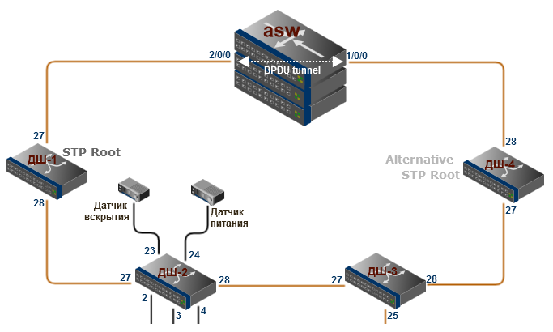
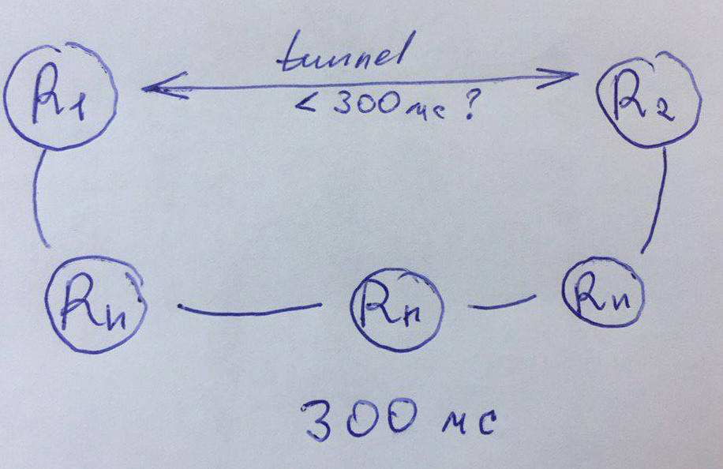

# Вопросы которые меня тревожат

### 1 Ограничение стекового кабеля

Почему в кольце между МКУ и ASW нельзя \(не нужно\) поднять LACP при использовании STP ?

### 2 Разница задержки на транспорте и в туннеле

Есть транспортная сеть, на ней задержка между R1 и R2 равна допустим 300мс. Если мы поднимем туннель поверх этого транспорта, может ли быть такое что задержка уменьшится ?  
Да, физика вся остается той же. Есть такое, что пока поднят туннель, устанавливается какая-то сессия и маршрутизаторам не приходится снова что то пересчитывать \(куда пересылать пакеты\) или что нибудь  в этом роде ?

